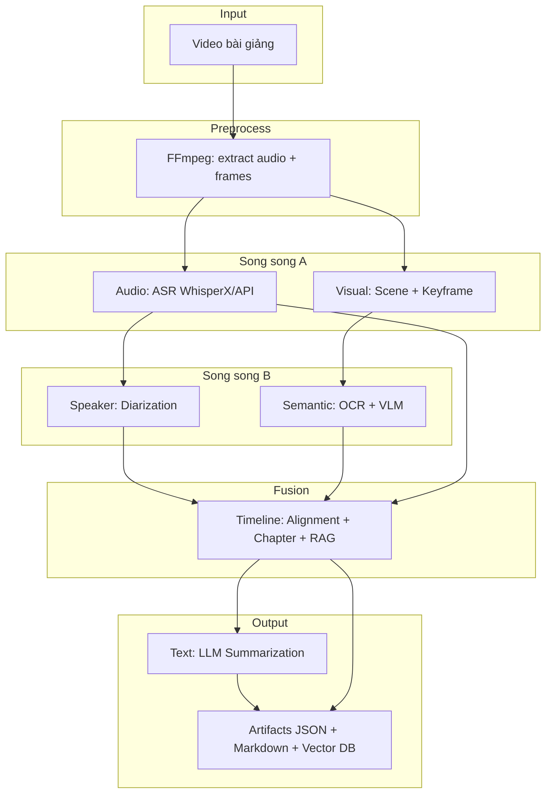
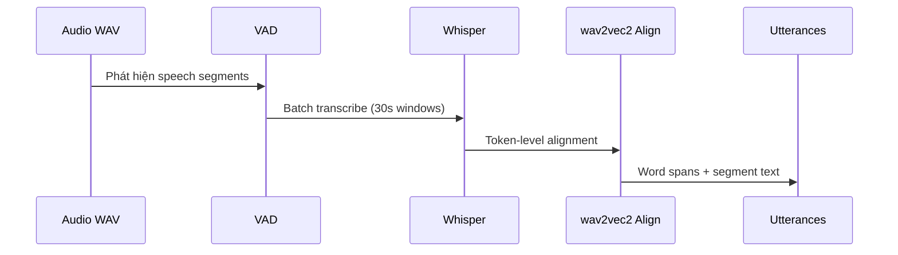
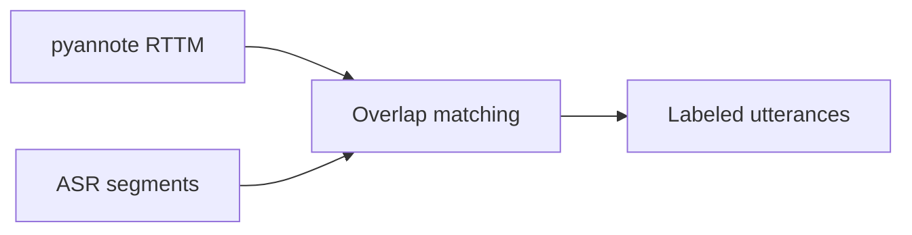
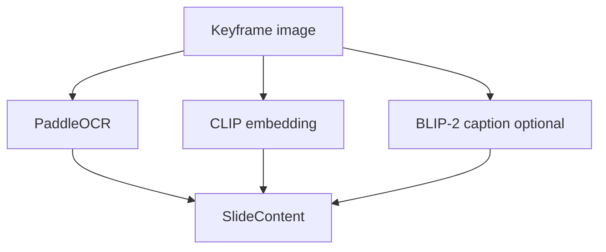
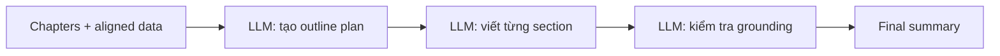

# Kiến trúc hệ thống — Multimodal Lecture Summarizer

Tài liệu mô tả kiến trúc chi tiết cho pipeline xử lý video bài giảng đa phương thức.

---

## 1. Mục tiêu & phạm vi

| Mục tiêu | Mô tả |
|----------|-------|
| **Input** | Video bài giảng (`.mp4`, `.mkv`, stream) 30–120 phút |
| **Output** | Transcript có timestamp, nhãn người nói, slide OCR, outline chương, tóm tắt có trích dẫn, index RAG |
| **Ngôn ngữ** | Ưu tiên tiếng Việt + tiếng Anh (mở rộng được) |
| **Triển khai** | Local GPU hoặc Cloud API (xem [STACK_COMPARISON.md](./STACK_COMPARISON.md)) |

---

## 2. Sơ đồ kiến trúc tổng thể



---

## 3. Cấu trúc thư mục repo

```
multimodal-lecture-summarizer/
├── configs/
│   ├── default.yaml              # Cấu hình mặc định
│   ├── stack_local_gpu.yaml      # Stack chạy trên GPU local
│   └── stack_api.yaml            # Stack dùng API cloud
├── docs/
│   ├── ARCHITECTURE.md           # Tài liệu này
│   ├── STACK_COMPARISON.md       # So sánh local vs API
│   └── BENCHMARK.md              # Khung đánh giá
├── benchmarks/
│   ├── manifest.csv              # Danh sách video + reference
│   ├── results_template.csv      # Template kết quả benchmark
│   └── references/               # Ground truth (transcript, RTTM, ...)
├── src/mls/
│   ├── pipeline.py               # Orchestrator
│   ├── models.py                 # Data models
│   ├── cli.py                    # CLI: mls run / mls benchmark
│   ├── modules/
│   │   ├── audio.py              # Stage 1: ASR
│   │   ├── speaker.py            # Stage 2: Diarization
│   │   ├── visual.py             # Stage 3: Scene detection
│   │   ├── semantic.py           # Stage 4: OCR + VLM
│   │   ├── timeline.py           # Stage 5: Alignment + RAG
│   │   └── text.py               # Stage 6: Summarization
│   └── benchmarks/
│       └── metrics.py            # Metric dataclasses
├── outputs/                      # Kết quả mỗi lần chạy
└── cache/                        # Model cache, chroma, keyframes
```

---

## 4. Chi tiết từng stage

### 4.1 Stage 0 — Preprocess (FFmpeg)

| Thành phần | Chi tiết |
|------------|----------|
| **Input** | `video_path` |
| **Output** | `audio.wav` (16 kHz mono), metadata duration |
| **Công cụ** | FFmpeg |
| **Ghi chú** | Chuẩn hóa format trước khi đưa vào ASR/diarization |

```bash
ffmpeg -i lecture.mp4 -vn -acodec pcm_s16le -ar 16000 -ac 1 cache/audio.wav
```

---

### 4.2 Stage 1 — Audio (ASR)

| Thuộc tính | Giá trị |
|------------|---------|
| **Mục tiêu** | Nhận dạng lời nói + timestamp từng từ |
| **Local** | WhisperX (`large-v3`) + wav2vec2 alignment |
| **API** | AssemblyAI / Deepgram / OpenAI |
| **Output** | `list[WordSpan]`, `list[Utterance]` (chưa có speaker) |

**Luồng WhisperX (local):**



**Interface module:**

```python
# src/mls/modules/audio.py
class AudioStage:
    def process(artifacts, config) -> LectureArtifacts:
        # 1. Load audio.wav
        # 2. Run ASR provider
        # 3. Populate artifacts.utterances (speaker_id="UNKNOWN")
```

---

### 4.3 Stage 2 — Speaker (Diarization)

| Thuộc tính | Giá trị |
|------------|---------|
| **Mục tiêu** | Gán `speaker_id` cho từng utterance |
| **Local** | pyannote `speaker-diarization-3.1` |
| **API** | AssemblyAI (bundled) / Deepgram diarize |
| **Output** | Utterances với `speaker_id`, RTTM file |

**Merge logic (ASR + Diarization):**

1. Lấy RTTM từ pyannote: `(speaker, start, end)`
2. Với mỗi utterance ASR, tìm speaker có **overlap duration** lớn nhất
3. Gán `speaker_id`; nếu overlap < 50% → đánh dấu `OVERLAP` hoặc `UNKNOWN`



**Tùy chọn nâng cao:** Speaker enrollment (voice profile giảng viên) để map `SPEAKER_00` → tên thật.

---

### 4.4 Stage 3 — Visual (Scene + Keyframe)

| Thuộc tính | Giá trị |
|------------|---------|
| **Mục tiêu** | Phát hiện chuyển cảnh, trích keyframe đại diện mỗi slide |
| **Công cụ** | PySceneDetect (`ContentDetector`) hoặc TransNetV2 |
| **Output** | `list[Scene]` với `start_sec`, `end_sec`, `keyframe_path` |

**Chiến lược keyframe:**

| Strategy | Khi nào dùng |
|----------|--------------|
| `middle` | Mặc định — ổn định với fade transition |
| `sharpest` | Slide có animation — chọn frame sắc nét nhất |
| `first` | Hard cut rõ ràng |

**Post-processing slide-specific:**

- Loại scene < 2 giây (thường là glitch)
- Gộp scene liên tiếp nếu histogram similarity > 0.95 (cùng slide)
- Phát hiện PiP: crop vùng slide (tùy template LMS)

---

### 4.5 Stage 4 — Semantic (OCR + Vision)

| Thuộc tính | Giá trị |
|------------|---------|
| **Mục tiêu** | Trích text và mô tả nội dung từng slide |
| **OCR local** | PaddleOCR (`vi+en`) |
| **OCR API** | Google Vision / Azure Read |
| **Vision local** | CLIP embedding + BLIP-2 caption |
| **Vision API** | GPT-4o vision batch |
| **Output** | `list[SlideContent]` |

**Per keyframe pipeline:**



**Rate limiting:** Tối đa `max_frames_per_minute` (mặc định 4–6) để kiểm soát chi phí GPU/API.

---

### 4.6 Stage 5 — Timeline (Alignment + Chapter + RAG)

Đây là **tầng fusion** quan trọng nhất — nối audio, speaker, slide theo thời gian.

#### 5a. Cross-modal alignment (Hybrid Maximum-Overlap Alignment)

Thay vì cắt file âm thanh vật lý theo biên của scene trước khi nhận dạng (điều này gây ra lỗi nuốt từ, ngắt câu đang nói dở, và giảm độ chính xác của Whisper do độ dài đoạn âm thanh không đồng đều), hệ thống áp dụng cơ chế **đối sánh ngược bằng thuật toán (Hybrid Alignment)**:

1. **Bước 1 (Continuous ASR)**: Chạy Whisper nhận dạng giọng nói liên tục trên toàn bộ video (hoặc block 30 giây liên tục) để lấy lời thoại kèm theo mốc thời gian chi tiết từng phân đoạn (`start` và `end` tính bằng giây), đảm bảo Whisper nhận dạng chính xác 100% ngữ cảnh không bị mất chữ.
2. **Bước 2 (Visual Segment Detection)**: Lấy danh sách thời gian chuyển cảnh từ PySceneDetect (ví dụ: Slide 1 từ `0s - 45s`, Slide 2 từ `45s - 120s`).
3. **Bước 3 (Maximum-Overlap Alignment)**: Áp dụng thuật toán đối sánh mốc thời gian. Với mỗi phân đoạn thoại (utterance), tính toán thời gian chồng lấn (overlap duration) với tất cả các scene. Utterance sẽ được gán hoàn toàn cho cảnh (scene/slide) nào có thời gian chồng lấn lớn nhất (`max_overlap`). Cách làm này đảm bảo ngữ thoại được gán duy nhất cho slide chứa trọng tâm câu thoại phát ra và không bị lặp câu thoại giữa các slide liền kề.

| Phương pháp | Mô tả |
|-------------|-------|
| `hybrid_max_overlap` | **Mặc định** — Chạy ASR liên tục rồi đối sánh mốc thời gian, gán câu thoại vào slide có lượng trùng khớp thời lượng lớn nhất. |
| `cross_modal` | Kết hợp scene boundary + CLIP similarity utterance↔slide |
| `clip_similarity` | Với mỗi cửa sổ 30s transcript, tìm slide có CLIP score cao nhất |

#### 5b. Chapter segmentation

| Phương pháp | Mô tả |
|-------------|-------|
| `fixed_window` | Mỗi N phút = 1 chương |
| `slide_boundary` | Mỗi nhóm slide mới = chương |
| `topic_shift` | **Khuyến nghị** — embedding cosine drop > threshold |

#### 5c. RAG index

```
Chunk = {
  text: utterance.text + slide.ocr_text,
  metadata: {
    start_sec, end_sec,
    speaker_id,
    slide_id,
    chapter_id
  }
}
→ embed → ChromaDB / OpenAI vector store
```

---

### 4.7 Stage 6 — Text (LLM Summarization)

| Thuộc tiêu | Chi tiết |
|------------|----------|
| **Outline** | Danh sách chương + tiêu đề |
| **Summary** | Tóm tắt có bullet, trích dẫn `[mm:ss]` và `[Slide N]` |
| **Grounding** | Mọi claim phải map về utterance/slide cụ thể |

**Plan-based summarization (giảm hallucination):**



**Prompt structure (rút gọn):**

```
Bạn là trợ lý tóm tắt bài giảng.
Dữ liệu: {chapters_with_citations}
Yêu cầu:
- Tóm tắt theo outline
- Mỗi ý phải có [timestamp] hoặc [Slide N]
- KHÔNG thêm thông tin không có trong nguồn
```

---

## 5. Data model

Xem `src/mls/models.py`:

| Model | Trường chính |
|-------|--------------|
| `WordSpan` | text, start_sec, end_sec, confidence |
| `Utterance` | speaker_id, text, words[] |
| `Scene` | scene_id, start_sec, end_sec, keyframe_path |
| `SlideContent` | ocr_text, caption, clip_embedding |
| `Chapter` | title, start_sec, end_sec, summary |
| `LectureArtifacts` | Tổng hợp tất cả + full_summary |

**Output JSON mẫu** (`outputs/{lecture_id}/artifacts.json`):

```json
{
  "video_path": "lecture_01.mp4",
  "duration_sec": 3720,
  "chapters": [
    {
      "chapter_id": 1,
      "title": "Giới thiệu môn học",
      "start_sec": 0,
      "end_sec": 480,
      "summary": "..."
    }
  ],
  "full_summary": "...",
  "metadata": {
    "stack": "local_gpu",
    "language": "vi",
    "processing_time_sec": 842
  }
}
```

---

## 6. Luồng thực thi & song song hóa

```mermaid
gantt
    title Pipeline 90 phút video (ước lượng local GPU RTX 4090)
    dateFormat X
    axisFormat %s

    section Preprocess
    FFmpeg extract     :0, 30

    section Parallel
    WhisperX ASR       :30, 540
    Scene detection    :30, 120
    pyannote diarize   :30, 180
    OCR + CLIP slides  :150, 300

    section Fusion
    Timeline align     :570, 90
    RAG index          :660, 60

    section Output
    LLM summarize      :720, 120
```



| Giai đoạn song song | Lý do |
|---------------------|-------|
| ASR ∥ Scene detect | Không phụ thuộc lẫn nhau sau khi extract audio |
| Diarization ∥ OCR | Cùng input từ audio / keyframes |
| Alignment sau cùng | Cần cả ASR + slides + speakers |

---

## 7. Caching & idempotency

| Cache key | Nội dung | TTL |
|-----------|----------|-----|
| `{video_hash}/audio.wav` | Audio extracted | Vĩnh viễn |
| `{video_hash}/asr.json` | ASR result | Vĩnh viễn |
| `{video_hash}/keyframes/` | Slide images | Vĩnh viễn |
| `{video_hash}/chroma/` | Vector index | Vĩnh viễn |

Chạy lại pipeline với cùng video + config → skip stage đã cache (flag `--force` để bỏ cache).

---

## 8. Xử lý lỗi & fallback

| Lỗi | Fallback |
|-----|----------|
| ASR hallucination im lặng | VAD strict + post-filter segment < 0.5s |
| Diarization DER cao | Dùng single-speaker mode (chỉ giảng viên) |
| OCR trống (slide ảnh) | Dùng BLIP/LLaVA caption thay OCR |
| CLIP alignment thấp | Fallback `slide_boundary` alignment |
| LLM hallucination | Grounding verification pass; reject ungrounded claims |

---

## 9. Bảo mật & triển khai

| Khía cạnh | Khuyến nghị |
|-----------|-------------|
| API keys | `.env` + không commit |
| Video nhạy cảm | Chạy local GPU, không gửi API |
| pyannote | Cần HuggingFace token + accept license |
| Scale | Queue-based worker (Celery/Redis) cho batch nhiều video |

---

## 10. Lộ trình triển khai

| Phase | Nội dung | Ưu tiên |
|-------|----------|---------|
| **P0 MVP** | WhisperX + pyannote + PySceneDetect + PaddleOCR + GPT-4o-mini | Cao |
| **P1** | Cross-modal alignment + chapter segmentation | Cao |
| **P2** | RAG Q&A + web UI | Trung bình |
| **P3** | Fine-tune Whisper domain + speaker enrollment | Thấp |

---

## 11. Tham chiếu

- [STACK_COMPARISON.md](./STACK_COMPARISON.md) — Local GPU vs API
- [BENCHMARK.md](./BENCHMARK.md) — Khung đánh giá trên video thực tế
- Config: `configs/default.yaml`, `configs/stack_local_gpu.yaml`, `configs/stack_api.yaml`
