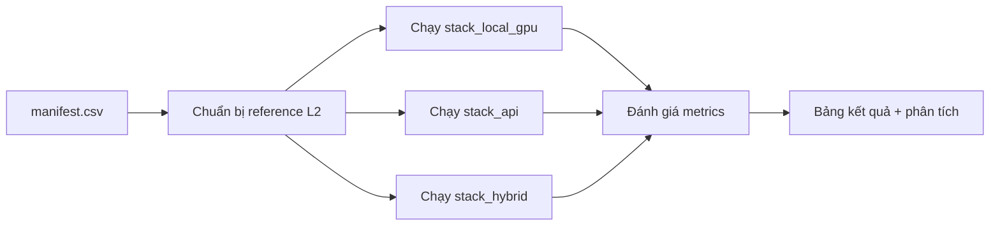

# Khung benchmark — Đánh giá trên video bài giảng thực tế

Hướng dẫn thiết lập, chạy và ghi nhận benchmark cho pipeline **multimodal-lecture-summarizer**.

---

## 1. Mục tiêu benchmark

| Mục tiêu | Metric chính |
|----------|--------------|
| Đo chất lượng ASR | WER, CER, timestamp P/R |
| Đo diarization | DER, confusion, miss |
| Đo visual | Scene F1, keyframe slide recall |
| Đo semantic | OCR char accuracy, CLIP alignment |
| Đo summary | ROUGE-L, factuality, human rating |
| Đo timeline | Slide sync MAE, chapter F1, RAG Hit@5 |
| Đo hệ thống | Latency, VRAM, API cost |

---

## 2. Bộ dữ liệu đánh giá (điền video của bạn)

### 2.1 Quy mô khuyến nghị

| Quy mô | Số video | Thời lượng | Mục đích |
|--------|----------|------------|----------|
| **Pilot** | 3 | 15–30 phút | Sanity check pipeline |
| **Standard** | 10–12 | 45–90 phút | So sánh stack |
| **Full** | 20+ | Đa dạng | Báo cáo chính thức |

### 2.2 Đa dạng hóa corpus

Để benchmark có ý nghĩa, chọn video đại diện:

| Dimension | Biến thể cần có | Ví dụ |
|-----------|----------------|-------|
| **Ngôn ngữ** | VI, EN, mixed | Giảng tiếng Việt có thuật ngữ EN |
| **Domain** | STEM, KHXH, soft-skill | Toán, Y khoa, Marketing |
| **Acoustic** | Mic tốt / mic phòng / online | Zoom recording vs phòng học |
| **Visual** | Slide nhiều / ít / bảng / demo code | PowerPoint vs viết bảng |
| **Speaker** | 1 người / Q&A / panel | Seminar có sinh viên hỏi |
| **Độ dài** | Ngắn 15p / dài 90p+ | Kiểm tra long-context |

### 2.3 Manifest (`benchmarks/manifest.csv`)

```csv
lecture_id,video_path,duration_min,language,domain,reference_transcript,reference_rttm,reference_slides_dir,reference_summary,reference_chapters,notes
lec_cs01,./data/cs_intro.mp4,62,vi,computer_science,./references/lec_cs01/transcript.txt,./references/lec_cs01/diarization.rttm,./references/lec_cs01/slides/,./references/lec_cs01/summary.md,./references/lec_cs01/chapters.json,mic phòng học
lec_math01,./data/calculus_1.mp4,88,vi,mathematics,...
lec_en01,./data/ml_lecture.mp4,75,en,computer_science,...
```

**Cột bắt buộc:** `lecture_id`, `video_path`, `duration_min`, `language`, `domain`

**Reference (ground truth) — mức độ chuẩn bị:**

| Level | Transcript | RTTM | Slides | Summary | Effort |
|-------|------------|------|--------|---------|--------|
| **L1 Minimal** | Sửa Whisper thủ công 10% | ❌ | ❌ | ❌ | ~1h/video |
| **L2 Standard** | Transcript đầy đủ | ❌ | Timestamp slide | ❌ | ~3h/video |
| **L3 Full** | Transcript + RTTM | ✅ | ✅ OCR ground truth | Summary + chapters | ~6–8h/video |

Khuyến nghị bắt đầu **L2** cho 5 video pilot.

---

## 3. Bảng benchmark metrics chi tiết

### 3.1 Audio (ASR)

| Metric | Công thức | Target tốt | Target chấp nhận | Tool |
|--------|-----------|------------|------------------|------|
| **WER** | (S+D+I)/N × 100% | < 10% (EN) | < 20% (VI) | `jiwer` |
| **CER** | Char-level WER | < 5% (EN) | < 12% (VI) | `jiwer` |
| **Timestamp Precision** | TP words / pred words (±200ms) | > 85% | > 70% | Custom |
| **Timestamp Recall** | TP words / ref words (±200ms) | > 75% | > 60% | Custom |
| **Hallucination rate** | Segments im lặng bị transcribe / tổng segments | < 2% | < 5% | VAD cross-check |

### 3.2 Speaker (Diarization)

| Metric | Công thức | Target tốt | Target chấp nhận | Tool |
|--------|-----------|------------|------------------|------|
| **DER** | (FA+Miss+Conf)/speech_duration | < 12% | < 20% | `pyannote.metrics` |
| **Speaker confusion** | Confusion / speech | < 5% | < 8% | pyannote |
| **Missed speech** | Miss / speech | < 8% | < 12% | pyannote |
| **False alarm** | FA / speech | < 4% | < 6% | pyannote |

*Lưu ý:* Bài giảng 1 speaker — DER ít quan trọng; tập trung vào Q&A segments.

### 3.3 Visual

| Metric | Công thức | Target tốt | Target chấp nhận |
|--------|-----------|------------|------------------|
| **Scene Precision** | TP cuts / pred cuts | > 90% | > 80% |
| **Scene Recall** | TP cuts / ref cuts | > 85% | > 75% |
| **Scene F1** | 2PR/(P+R) | > 87% | > 77% |
| **Keyframe slide recall** | Slides có keyframe đúng / ref slides | > 90% | > 80% |

**Cách tạo ground truth slide:** Ghi timestamp thủ công mỗi lần chuyển slide (từ player), hoặc export từ PowerPoint recording.

### 3.4 Semantic

| Metric | Công thức | Target tốt | Target chấp nhận |
|--------|-----------|------------|------------------|
| **OCR char accuracy** | 1 - CER(ocr, ground_truth) | > 95% | > 88% |
| **CLIP alignment score** | Mean max cosine sim utterance↔slide | > 0.35 | > 0.25 |
| **Caption faithfulness** | % câu caption đúng (human eval 20 frame) | > 80% | > 65% |

### 3.5 Text (Summary)

| Metric | Công thức | Target tốt | Target chấp nhận |
|--------|-----------|------------|------------------|
| **ROUGE-L** | vs reference summary | > 0.35 | > 0.25 |
| **BERTScore F1** | vs reference | > 0.85 | > 0.80 |
| **Factuality rate** | % claims có nguồn đúng (human/LLM judge) | > 90% | > 80% |
| **Human rating 1–5** | Trung bình 3 annotator | > 4.0 | > 3.5 |

### 3.6 Timeline

| Metric | Công thức | Target tốt | Target chấp nhận |
|--------|-----------|------------|------------------|
| **Slide sync MAE** | Mean |pred_ts - ref_ts| per slide (giây) | < 5s | < 15s |
| **Chapter boundary F1** | F1 chapter start times (±60s) | > 0.70 | > 0.55 |
| **RAG Hit@5** | % câu hỏi đúng chunk trong top-5 | > 80% | > 65% |

### 3.7 System

| Metric | Đơn vị | Ghi chú |
|--------|--------|---------|
| **Total latency** | giây | End-to-end |
| **Latency / phút video** | giây/min | normalized |
| **VRAM peak** | GB | nvidia-smi max |
| **API cost** | USD | tổng per video |
| **Cost / giờ video** | USD/h | normalized |

---

## 4. Bảng kết quả mẫu (điền sau khi chạy)

### 4.1 So sánh stack trên cùng corpus

| lecture_id | stack | dur(min) | WER↓ | DER↓ | scene_F1↑ | OCR_acc↑ | sync_MAE↓ | ROUGE-L↑ | factuality↑ | RAG@5↑ | latency↓ | cost($)↓ |
|------------|-------|----------|------|------|-----------|----------|-----------|----------|-------------|--------|----------|----------|
| lec_cs01 | local_gpu | 62 | — | — | — | — | — | — | — | — | — | ~0.10 |
| lec_cs01 | api | 62 | — | — | — | — | — | — | — | — | — | ~3.50 |
| lec_cs01 | hybrid | 62 | — | — | — | — | — | — | — | — | — | ~1.20 |
| lec_math01 | local_gpu | 88 | — | — | — | — | — | — | — | — | — | — |
| ... | ... | ... | ... | ... | ... | ... | ... | ... | ... | ... | ... | ... |
| **Mean** | local_gpu | — | *TBD* | *TBD* | *TBD* | *TBD* | *TBD* | *TBD* | *TBD* | *TBD* | *TBD* | *TBD* |
| **Mean** | api | — | *TBD* | *TBD* | *TBD* | *TBD* | *TBD* | *TBD* | *TBD* | *TBD* | *TBD* | *TBD* |
| **Mean** | hybrid | — | *TBD* | *TBD* | *TBD* | *TBD* | *TBD* | *TBD* | *TBD* | *TBD* | *TBD* | *TBD* |

↓ = thấp hơn tốt hơn, ↑ = cao hơn tốt hơn

### 4.2 Phân tích theo domain

| Domain | n | WER mean | OCR_acc mean | ROUGE-L mean | Ghi chú |
|--------|---|----------|--------------|--------------|---------|
| Computer Science | — | — | — | — | Nhiều code snippet |
| Mathematics | — | — | — | — | Công thức OCR khó |
| Medicine | — | — | — | — | Thuật ngữ Latin |
| Humanities | — | — | — | — | Ít slide, nhiều nói |
| English lecture | — | — | — | — | WER thường thấp hơn |

### 4.3 Phân tích theo điều kiện acoustic

| Điều kiện | n | WER | DER | Ghi chú |
|-----------|---|-----|-----|---------|
| Mic headset / Zoom | — | — | — | Tốt nhất |
| Mic phòng học | — | — | — | Echo, SNR thấp |
| Có Q&A | — | — | — | DER tăng |

---

## 5. Bộ câu hỏi RAG (20 câu chuẩn / video)

Tạo file `benchmarks/references/{lecture_id}/qa.json`:

```json
[
  {
    "id": "q01",
    "question": "Giảng viên định nghĩa gradient descent ở phút nào?",
    "expected_answer_contains": ["gradient", "descent"],
    "ground_truth_timestamp_sec": 1234,
    "ground_truth_slide_id": 15
  },
  {
    "id": "q02",
    "question": "Công thức loss function trên slide 8 là gì?",
    "expected_answer_contains": ["MSE", "mean squared"],
    "ground_truth_timestamp_sec": 890,
    "ground_truth_slide_id": 8
  }
]
```

**Đánh giá RAG Hit@5:**
- Retrieve top-5 chunks
- Hit nếu chunk chứa `ground_truth_timestamp_sec` ± 30s HOẶC `ground_truth_slide_id`

---

## 6. Quy trình chạy benchmark



### Bước 1 — Chuẩn bị reference

```bash
mkdir -p benchmarks/references/lec_cs01
# 1. Transcript: sửa Whisper output hoặc transcribe thủ công
# 2. Slide timestamps: file slides.json
# 3. Summary: viết tóm tắt 1-2 trang (hoặc dùng abstract môn học)
```

**`slides.json` mẫu:**

```json
[
  {"slide_id": 1, "timestamp_sec": 0.0, "title": "Tiêu đề bài giảng"},
  {"slide_id": 2, "timestamp_sec": 125.5, "title": "Chương 1: Giới thiệu"},
  {"slide_id": 3, "timestamp_sec": 340.2, "title": "Định nghĩa"}
]
```

### Bước 2 — Chạy pipeline

```bash
pip install -e ".[local-gpu,api,dev]"

# Local GPU
mls run ./data/cs_intro.mp4 --config configs/stack_local_gpu.yaml

# API
mls run ./data/cs_intro.mp4 --config configs/stack_api.yaml
```

### Bước 3 — Tính metrics (script tương lai)

```bash
mls benchmark --manifest benchmarks/manifest.csv --config configs/stack_local_gpu.yaml
# → benchmarks/results/local_gpu_2025-06-29.csv
```

### Bước 4 — Human evaluation

| Tiêu chí | Thang 1–5 | Mô tả |
|----------|-----------|-------|
| **Completeness** | 1–5 | Tóm tắt có đủ ý chính? |
| **Accuracy** | 1–5 | Thông tin đúng với video? |
| **Structure** | 1–5 | Outline rõ ràng, logic? |
| **Readability** | 1–5 | Dễ đọc, ngữ pháp tốt? |
| **Usefulness** | 1–5 | Hữu ích cho ôn thi/review? |

3 người đánh giá độc lập → lấy trung bình + Cohen's κ để đo agreement.

---

## 7. Checklist trước khi benchmark

- [ ] Đã có ≥ 3 video pilot đa dạng (ngôn ngữ, domain, độ dài)
- [ ] Đã có transcript reference (L2+) cho ít nhất 3 video
- [ ] Đã ghi slide timestamps cho video có PowerPoint
- [ ] Đã tạo 10–20 câu hỏi RAG / video
- [ ] Đã ghi nhận GPU model + VRAM khi chạy local
- [ ] Đã log API cost từ dashboard provider
- [ ] Đã chạy cùng video trên ≥ 2 stack để so sánh

---

## 8. Baseline tham chiếu (literature)

Dùng làm mốc kỳ vọng — **không phải target bắt buộc**:

| Metric | Literature / benchmark | Ghi chú |
|--------|------------------------|---------|
| WER lecture EN | 8.9–14.2% | [asr-bench](https://github.com/Ryfter/asr-bench) 12 lectures |
| WER WhisperX TED-LIUM | 9.7% | WhisperX paper |
| DER AMI mic xa | 15.6–22.7% | pyannote 3.1 |
| Scene F1 (general video) | 85–96% | PySceneDetect vs TransNetV2 |
| OCR slide printed | 93–98% | PaddleOCR |
| ROUGE-L scientific video | 0.25–0.40 | VISTA dataset |
| RAG Hit@5 domain QA | 70–85% | Tùy corpus |

---

## 9. Template kết quả

Sao chép `benchmarks/results_template.csv` sau mỗi lần chạy:

```csv
lecture_id,stack,duration_min,wer,der,scene_f1,ocr_char_acc,slide_sync_mae_sec,rouge_l,factuality_rate,rag_hit_at_5,latency_sec,vram_peak_gb,api_cost_usd,notes
lec_cs01,local_gpu,62,11.2,,0.89,0.94,8.5,0.31,0.85,0.72,720,14.2,0.10,
lec_cs01,api,62,9.8,,0.89,0.96,6.2,0.38,0.92,0.78,540,,3.45,
```

---

## 10. Báo cáo kết quả (mẫu markdown)

Sau khi điền bảng, tổng hợp:

```markdown
## Kết quả benchmark — [Ngày]

**Corpus:** 10 bài giảng, tổng 614 phút, 6 tiếng Việt + 4 tiếng Anh

### Tóm tắt
| Stack | WER↓ | ROUGE-L↑ | Factuality↑ | Cost/video | Latency/video |
|-------|------|----------|-------------|------------|---------------|
| local_gpu | X% | X | X% | $X | X min |
| api | X% | X | X% | $X | X min |
| hybrid | X% | X | X% | $X | X min |

### Phát hiện chính
1. WER tiếng Việt cao hơn EN ~X%
2. OCR yếu nhất ở bài toán (công thức)
3. Hybrid đạt 90% chất lượng API với 30% chi phí

### Khuyến nghị
- Production: stack hybrid
- STEM có công thức: bổ sung LaTeX OCR hoặc GPT-4o vision selective
```

---

## 11. File liên quan

| File | Mục đích |
|------|----------|
| `benchmarks/manifest.csv` | Danh sách video + đường dẫn reference |
| `benchmarks/results_template.csv` | Template ghi kết quả |
| `src/mls/benchmarks/metrics.py` | Dataclass metrics |
| `docs/STACK_COMPARISON.md` | So sánh stack |
| `docs/ARCHITECTURE.md` | Kiến trúc pipeline |
