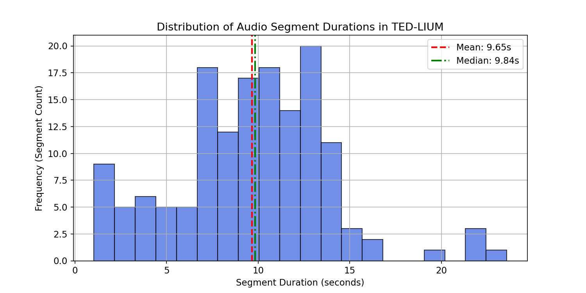
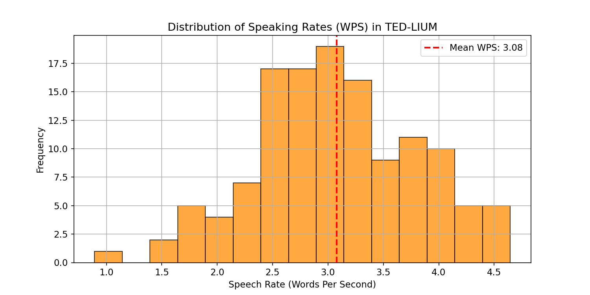
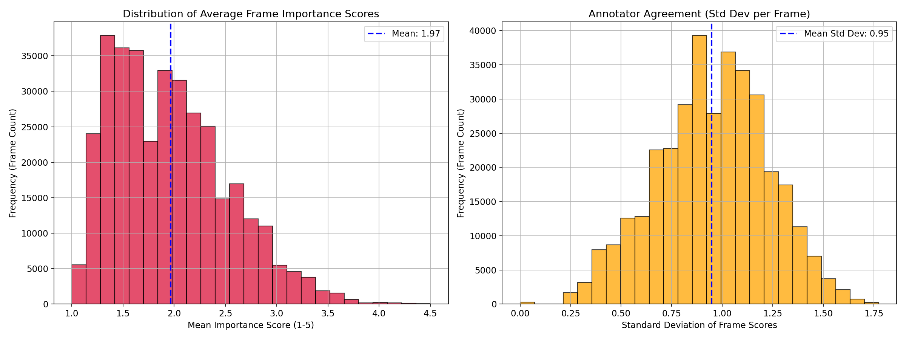
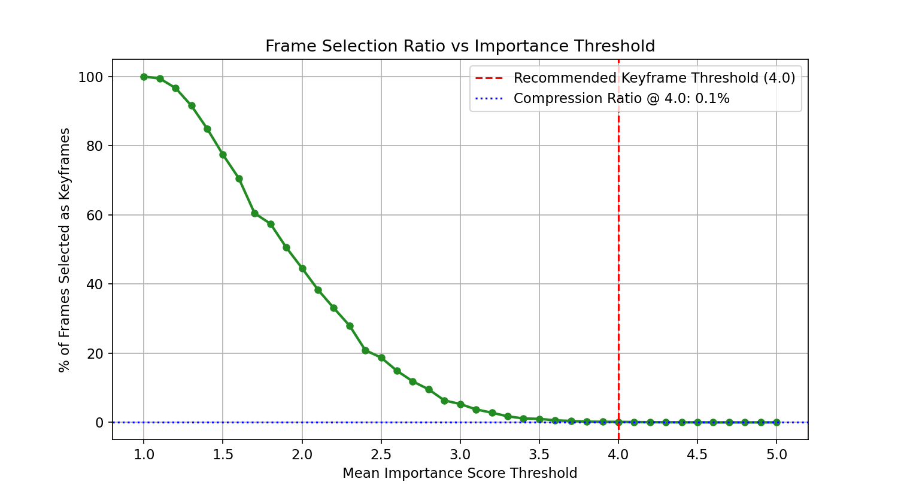

# CHƯƠNG 4: THỰC NGHIỆM VÀ ĐÁNH GIÁ HỆ THỐNG

Báo cáo này tóm tắt kết quả Phân tích Khám phá Dữ liệu (EDA) thực hiện trong notebook [eda_datasets.ipynb](file:///c:/Users/admin/multimodal-lecture-summarizer/experiments/notebooks/eda_datasets.ipynb) đối với hai bộ dữ liệu nền tảng phục vụ cho hệ thống **Multimodal Lecture Summarizer** (TED-LIUM và TVSum).

## 4.1 Mô tả tập dữ liệu

Quá trình thực nghiệm được tiến hành độc lập trên hai tập dữ liệu khác nhau, phục vụ cho hai bài toán cốt lõi của hệ thống: nhận dạng giọng nói và tóm tắt video.

*   **TEDLIUM**: Đây là một kho dữ liệu âm thanh chuyên dụng được trích xuất từ các bài diễn thuyết thực tế bằng tiếng Anh. Môi trường âm thanh trong tập dữ liệu này rất sát với bài toán thực tế mà đồ án hướng tới: diễn giả nói chuyện trong một hội trường lớn, có tiếng ồn nền, có sự đa dạng về ngữ điệu và tốc độ nói. Việc sử dụng TEDLIUM giúp đo đạc chính xác khả năng bóc tách khoảng lặng và độ chuẩn xác của mô hình giải mã văn bản.
*   **TVSUM**: Tập dữ liệu này chứa năm mươi video ngắn được thu thập từ YouTube, bao trùm mười chủ đề khác nhau như tin tức, phim tài liệu, bài giảng và hướng dẫn thực hành. Điểm giá trị nhất của TVSUM là mỗi video đều đi kèm với nhãn đánh giá mức độ quan trọng ở cấp độ khung hình do con người gán thủ công. Dữ liệu này đóng vai trò làm tiêu chuẩn vàng để hệ thống đối chiếu và đo lường khả năng trích xuất các khung hình mang tính trọng tâm.

---

## 4.2 Phân tích Dữ liệu TED-LIUM (Audio & ASR)

Tập dữ liệu TED-LIUM bao gồm các phân đoạn âm thanh từ các bài thuyết trình TED Talks thực tế, chứa các đặc điểm âm học phong phú (tiếng ồn khán phòng, tốc độ nói thay đổi, giọng nói nam/nữ đa dạng). 

### 4.2.1 Quy mô dữ liệu (Data Quantities)
* **Tổng số phân đoạn ghi nhận trong metadata**: 150 phân đoạn
* **Tổng số file âm thanh (.wav)**: 150 file (được lưu tại thư mục `audio/`)

### 4.2.2 Phân phối Thời lượng Phân đoạn (Duration Distribution)
Thời lượng của phân đoạn phản ánh cách các câu thuyết trình được ngắt nghỉ theo hơi thở hoặc nhịp điệu của người nói.
* **Thời lượng trung bình (Mean)**: $9.65$ giây
* **Thời lượng trung vị (Median)**: $9.84$ giây
* **Độ lệch chuẩn (Std Dev)**: $4.32$ giây
* **Thời lượng ngắn nhất (Min)**: $1.03$ giây
* **Thời lượng dài nhất (Max)**: $23.57$ giây

> [!NOTE]
> Hơn 50% các mẫu phân đoạn nằm trong khoảng ngắn từ **7.25 giây đến 12.44 giây** (phạm vi 25% - 75%). Điều này cho thấy VAD (Voice Activity Detection) sẽ phải xử lý các điểm dừng/ngắt giọng với tần suất rất cao.

### 4.2.3 Phân tích Tốc độ Nói (Speaking Rate - WPS)
Tốc độ nói được đo bằng số từ trên giây (**Words Per Second - WPS**) đối với 128 phân đoạn hợp lệ (loại bỏ các nhãn segment trống hoặc segment bị bỏ qua khi tính điểm):
* **Tốc độ nói trung bình**: $3.08$ WPS (~185 từ/phút)
* **Độ lệch chuẩn**: $0.74$ WPS
* **Tốc độ nói nhỏ nhất (Min)**: $0.89$ WPS (Nói rất chậm/ngắt quãng)
* **Tốc độ nói lớn nhất (Max)**: $4.64$ WPS (Nói rất nhanh/dồn dập)

> [!IMPORTANT]
> Tốc độ nói trung bình ~3.08 WPS là một thử thách đối với các mô hình STT (Speech-to-Text) truyền thống. Người nói quá nhanh (>4 WPS) dễ gây ra lỗi nuốt từ (deletion error), trong khi người nói quá chậm (<1.5 WPS) dễ dẫn đến lỗi lặp/thêm từ (insertion error). Do đó hệ thống cần WhisperX với khả năng căn chỉnh cấp độ từ (word-level alignment) để tối ưu hóa.

---

## 4.3 Phân tích Dữ liệu TVSum (Video Summarization)

TVSum chứa các video YouTube thuộc nhiều chủ đề khác nhau. Mỗi khung hình (frame) được đánh giá điểm quan trọng từ 1 đến 5 bởi 20 người chấm (annotators) độc lập.

### 4.3.1 Quy mô dữ liệu (Data Quantities)
* **Tổng số video**: 50 videos
* **Số danh mục (Category)**: 10 danh mục (mỗi danh mục có chính xác 5 videos):
  * **BK** (Book Review): 5 videos
  * **BT** (Beauty): 5 videos
  * **DS** (Dog Show): 5 videos
  * **FM** (Food & Drink): 5 videos
  * **GA** (Gaming): 5 videos
  * **MS** (Movie Show): 5 videos
  * **PK** (Parkour): 5 videos
  * **PR** (Personal Product Review): 5 videos
  * **VT** (Vehicle Trip): 5 videos
  * **VU** (Video Gaming): 5 videos
* **Tổng số khung hình (frames) được phân tích**: 352,353 frames

### 4.3.2 Phân phối Điểm số Quan trọng (Importance Scores)
* **Điểm quan trọng trung bình**: $2.7661 \pm 0.4431$ (trên thang điểm 5.0)
* **Độ lệch đồng thuận trung bình (Annotator Consensus Std Dev)**: $0.8190$

> [!TIP]
> Độ lệch đồng thuận $0.8190$ cho thấy có sự khác biệt tương đối lớn trong cảm nhận của con người về độ quan trọng của các khung hình, phản ánh tính chủ quan trong bài toán tóm tắt video.

### 4.3.3 Ngưỡng Lọc Khung hình Khóa & Tỷ lệ Nén (Compression Thresholds)
Để chọn ra các khung hình tiêu biểu, chúng ta cần đặt ngưỡng điểm trung bình nhằm giữ lại các khung hình thực sự có giá trị:
* **Ngưỡng $\ge 3.0$**: Chọn **31.90%** số lượng khung hình của video.
* **Ngưỡng $\ge 4.0$ (Độ quan trọng cao)**: Chỉ giữ lại **3.42%** số lượng khung hình.
* **Ngưỡng $\ge 4.5$ (Độ quan trọng cực cao)**: Chỉ giữ lại **0.17%** số lượng khung hình.

### 4.3.4 Ý nghĩa đối với Thiết kế Bộ Tóm tắt Hình ảnh (Visual Summarizer)
* Điểm số trung bình chủ yếu tập trung quanh mức trung vị $2.5 - 3.0$. Việc áp dụng một ngưỡng cứng (ví dụ: $\ge 4.0$) sẽ khiến summary video quá ngắn và mất thông tin.
* Giải pháp tối ưu là thiết lập **tỷ lệ nén động (dynamic compression ratio)** hoặc **ngưỡng tương đối (top K%)** (thường là chọn top 10% - 20% khung hình có điểm cao nhất của mỗi video) thay vì dùng ngưỡng tuyệt đối cố định cho mọi video.
