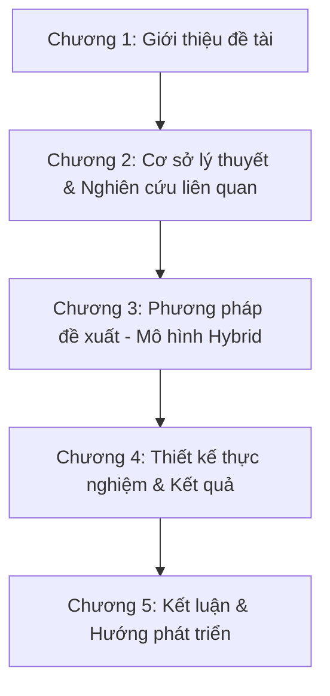

# Đề Cương Thiết Kế Nghiên Cứu & Kịch Bản Thử Nghiệm (Multimodal Lecture Summarizer)

Tài liệu này đóng vai trò là khung lý thuyết và thực nghiệm (empirical framework) phục vụ cho việc viết đề cương, báo cáo tiến độ và viết chương **Thực nghiệm & Đánh giá (Experiments & Evaluation)** của luận văn tốt nghiệp / đề tài nghiên cứu.

---

## 1. Các Câu hỏi Nghiên cứu Cốt lõi (Core Research Questions - RQs)

Để đề tài có tính thuyết phục khoa học, toàn bộ quá trình thực nghiệm và các bài toán cần phải tập trung trả lời 3 câu hỏi nghiên cứu chính dưới đây:

*   **RQ1 (Hiệu quả Dung hợp Đa phương thức):** Cơ chế Cross-modal Attention kết hợp đặc trưng hình ảnh (Keyframe), văn bản slide (OCR) và lời thoại (Transcript) cải thiện độ chính xác trong việc phân đoạn ngữ nghĩa và định vị chủ đề bài học như thế nào so với việc chỉ sử dụng đơn lẻ một phương thức (Single-modality)?
*   **RQ2 (Giải quyết ảo tưởng bằng Tóm tắt Phân cấp):** Phương pháp tóm tắt phân cấp (Hierarchical Summarization) dựa trên cấu trúc scene/chapter giúp tăng tính chân thực (factual consistency) và giảm hiện tượng ảo tưởng (hallucination) của LLM như thế nào đối với các bài giảng siêu dài (> 60 phút) so với phương pháp tóm tắt phẳng (Flat Summarization - đưa toàn bộ transcript vào LLM)?
*   **RQ3 (Bài toán tối ưu Hiệu năng & Chi phí):** Kiến trúc Hybrid (Local Feature Extraction + Custom Fusion Layer + Lightweight Summarizer) đạt được sự cân bằng (trade-off) như thế nào về độ chính xác, thời gian xử lý (latency) và chi phí tài nguyên tính toán (VRAM, API token cost) so với các mô hình Video-Language lớn (Video-LLMs) chạy end-to-end?

---

## 2. Thiết kế Thử nghiệm Nghiên cứu Suy hao (Ablation Studies)

Nghiên cứu suy hao (Ablation Study) là phần bắt buộc trong các bài báo khoa học hàng đầu để chứng minh vai trò đóng góp của từng thành phần trong mô hình lai (Hybrid model).

### Thử nghiệm 1: Đánh giá vai trò của các Modalities (Đặc trưng đầu vào)
Bạn cần huấn luyện các phiên bản mô hình bị lược bỏ các nhánh đầu vào khác nhau và đo lường độ chính xác của vector biểu diễn scene thu được (đánh giá gián tiếp qua tác vụ phân đoạn chương hoặc phân loại chủ đề).

| Tên Mô hình | Nhánh Visual (CLIP) | Nhánh OCR (PaddleOCR) | Nhánh Transcript (Whisper) | Mục tiêu chứng minh |
| :--- | :---: | :---: | :---: | :--- |
| **M1 (Baseline Text)** | ❌ | ❌ |  (PhoBERT) | Đánh giá mức độ hiệu quả khi chỉ nghe giảng viên nói (không có slide). |
| **M2 (Visual + Text)** |  | ❌ |  | Đo lường ảnh hưởng khi thiếu thông tin chữ viết chi tiết trên slide. |
| **M3 (OCR + Text)** | ❌ |  |  | Đo lường ảnh hưởng khi thiếu thông tin trực quan (hình vẽ, sơ đồ). |
| **M4 (Proposed Hybrid)**|  |  |  | **Mô hình đề xuất đầy đủ.** |

### Thử nghiệm 2: So sánh các cơ chế Dung hợp (Fusion Mechanisms)
So sánh cơ chế **Cross-modal Attention** đề xuất của bạn với các phương pháp dung hợp đặc trưng kinh điển khác:
*   **Early Fusion (Concatenation):** Ghép nối trực tiếp các vector đặc trưng lại với nhau rồi đi qua một mạng tuyến tính đơn giản: $z = W[v; o; t] + b$.
*   **Late Fusion (Average Pooling):** Chiếu các vector về cùng số chiều rồi lấy trung bình cộng: $z = \frac{v' + o' + t'}{3}$.
*   **Cross-modal Attention (Đề xuất):** Dùng đặc trưng visual làm Query để trích xuất có chọn lọc các thông tin văn bản phù hợp nhất từ slide và transcript.

---

## 3. So sánh đối chứng (Comparative Analysis) với SOTA

Để làm nổi bật giá trị của hệ thống, bạn cần chọn đối thủ so sánh (Baselines) là các mô hình SOTA hiện nay:

1.  **So sánh với Pipeline truyền thống:** Sử dụng PySceneDetect thô + trích xuất keyframe mặc định + gọi LLM tóm tắt thẳng không phân cấp.
2.  **So sánh với SOTA Video-LLMs (End-to-End):** Chạy trực tiếp các mô hình Video-Language Models mạnh mẽ như **Qwen2-VL** hoặc **LLaVA-NeXt-Video** để tóm tắt video.
    *   *Tiêu chí so sánh:*
        *   **Độ chính xác của Chương (Chaptering Accuracy):** Sai lệch timestamp (giây) giữa chương tự động tạo so với nhãn của con người.
        *   **Factuality:** Số lượng thông tin bịa đặt (hallucinations) trong bản tóm tắt.
        *   **VRAM Utilization:** Lượng VRAM sử dụng (GB) khi chạy.
        *   **Processing Latency:** Thời gian cần để xử lý 1 giờ video.

---

## 4. Hệ thống Chỉ số Đánh giá (Evaluation Metrics)

Khi viết phần kết quả nghiên cứu, bạn cần sử dụng các chỉ số toán học chuẩn đã được quốc tế công nhận:

### A. Đánh giá phân đoạn chương hồi (Video Chaptering)
Để so sánh ranh giới chương tự động tạo với nhãn do con người gán (Ground Truth), sử dụng các metric sau:
*   **$P_k$ Metric (Beeferman et al., 1999):** Chỉ số đo lường xác suất một phân đoạn ngẫu nhiên bị phân lớp sai. Điểm $P_k$ càng thấp thì mô hình phân chia chương càng khớp với con người.
*   **WindowDiff (Pevzner & Hearst, 2002):** Bản cải tiến của $P_k$, khắc phục nhược điểm nhạy cảm với mật độ ranh giới. Đây là chỉ số chuẩn mực trong tác vụ Topic Segmentation hiện nay.
*   **Precision, Recall, F1-score (với dung sai $\delta$):** Ví dụ cho phép sai số $\delta = \pm 15$ giây hoặc $\pm 30$ giây xung quanh ranh giới chương chuẩn.

### B. Đánh giá chất lượng bản tóm tắt (Summarization)
*   **ROUGE-1, ROUGE-2, ROUGE-L:** Đo lường tỉ lệ trùng khớp từ đơn, từ đôi và chuỗi con chung dài nhất giữa bản tóm tắt máy sinh ra và bản tóm tắt của con người.
*   **BERTScore:** Sử dụng contextual embeddings của RoBERTa/PhoBERT để tính độ tương đồng ngữ nghĩa giữa các câu, tránh việc phạt mô hình khi sử dụng các từ đồng nghĩa mà ROUGE thường mắc phải.
*   **G-Eval (GPT-4o Evaluation):** Phương pháp đánh giá sử dụng LLM cấu hình prompt đóng vai trò chuyên gia đánh giá theo 4 tiêu chí (thang điểm 1-5):
    1.  *Coherence (Tính liên kết):* Bản tóm tắt có cấu trúc logic tốt không?
    2.  *Consistency (Tính nhất quán):* Bản tóm tắt có bịa đặt ra thông tin ngoài video không?
    3.  *Fluency (Sự trôi chảy):* Câu từ có tự nhiên không?
    4.  *Relevance (Tính liên quan):* Có giữ lại được các ý chính của bài giảng không?

---

## 5. Cấu trúc Chương Nghiên cứu đề xuất cho Luận văn

Dưới đây là khung dàn ý gợi ý giúp bạn viết luận văn học thuật một cách có hệ thống:

### Chi tiết các chương:

*   **Chương 1: Giới thiệu (Introduction)**
    *   Đặt vấn đề: Sự bùng nổ của video bài giảng trực tuyến (E-learning) và khó khăn của người học khi tiếp thu video dài.
    *   Mục tiêu đề tài và giới hạn nghiên cứu.
*   **Chương 2: Cơ sở lý thuyết & Nghiên cứu liên quan (Literature Review)**
    *   Phân tích các công trình về: Nhận dạng giọng nói (ASR), Xử lý ảnh bài giảng (OCR, Keyframe extraction), và Tóm tắt văn bản.
    *   Đi sâu phân tích cơ chế Cross-modal Attention và các kiến trúc dung hợp SOTA. Chỉ ra khoảng trống nghiên cứu (gap): Các mô hình lớn tốn tài nguyên và dễ ảo tưởng trên video bài giảng dài.
*   **Chương 3: Phương pháp đề xuất (Proposed Methodology)**
    *   Mô tả tổng quan kiến trúc hệ thống Hybrid.
    *   Toán học hóa cơ chế **Multimodal Scene Encoder**: Chi tiết các lớp Projection, kiến trúc Multi-head Cross-modal Attention, Residual layers.
    *   Mô tả thuật toán tự giám sát Contrastive Loss sử dụng để huấn luyện bộ encoder.
    *   Thiết kế thuật toán phân đoạn chương hồi và tóm tắt phân cấp.
*   **Chương 4: Thực nghiệm & Đánh giá (Experiments & Results)**
    *   Mô tả tập dữ liệu (dataset) tự thu thập hoặc các dataset public.
    *   Kết quả các bài thử nghiệm Ablation Study (RQ1).
    *   Kết quả đối chứng chất lượng tóm tắt (ROUGE, BERTScore, G-Eval) (RQ2).
    *   Kết quả đánh giá tốc độ và tài nguyên tiêu hao (RQ3).
*   **Chương 5: Kết luận (Conclusion & Future Work)**
    *   Tóm tắt các đóng góp khoa học chính.
    *   Các hạn chế hiện tại của mô hình Hybrid và hướng giải quyết trong tương lai (ví dụ: cá nhân hóa tóm tắt, hỗ trợ đa ngôn ngữ tốt hơn).
