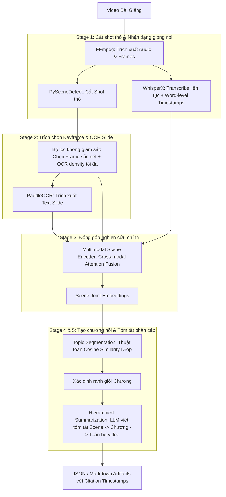

# Đánh giá Lộ trình Triển khai & Khảo sát Mô hình SOTA (Multimodal Lecture Summarizer)

Tài liệu này đánh giá tính khả thi của lộ trình phát triển hệ thống **Tóm tắt bài giảng đa phương thức (Multimodal Lecture Summarizer)** phục vụ cho mục tiêu nghiên cứu làm luận văn/đề tài. Đồng thời, tài liệu cung cấp khảo sát chi tiết về ưu/nhược điểm của các mô hình đã được công bố trên các tạp chí và hội nghị khoa học lớn (CVPR, ICCV, ECCV, ACL, EMNLP, TPAMI).

---

## 1. Đánh giá tổng quan tính khả thi (Executive Summary)

Lộ trình 5 bước được đề xuất có cấu trúc logic rất chặt chẽ và bao phủ toàn diện các thành phần của một hệ thống xử lý video đa phương thức. Điểm nhấn nghiên cứu (**Multimodal Scene Encoder** kết hợp với **Hierarchical Summarization**) là một hướng đi rất triển vọng, có giá trị học thuật cao và đủ độ mới (novelty) để làm trọng tâm cho đồ án tốt nghiệp hoặc bài báo khoa học.

Tuy nhiên, trong khuôn khổ thời gian giới hạn của một luận văn (thường từ 6–12 tháng) và tài nguyên tính toán cá nhân, việc **tự huấn luyện từ đầu (self-train from scratch)** toàn bộ 5 mô hình/mạng mạng thần kinh là **cực kỳ rủi ro và thiếu khả thi**. 

### Các thách thức cốt lõi:
1. **Thiếu hụt dữ liệu gán nhãn chuẩn (Data Bottleneck):** Các tác vụ như phân đoạn cảnh (Scene Segmentation) hay chọn khung hình khóa (Keyframe Selection) trên video bài giảng chưa có các bộ dữ liệu benchmark lớn tương đương như phim ảnh (MovieNet). Việc tự gán nhãn hàng trăm giờ video bài giảng thủ công sẽ chiếm đến 70% thời gian thực hiện đề tài.
2. **Chi phí tính toán (Compute Cost):** Huấn luyện các mô hình học sâu xử lý video (3D CNNs, Video Transformers) yêu cầu hạ tầng GPU rất lớn (A100/H100) và thời gian hội tụ lâu.

### Đề xuất chiến lược (Hybrid Approach):
> [!TIP]
> **Giữ nguyên mục tiêu nghiên cứu nhưng thay đổi phương pháp thực hiện:** 
> - **Đóng băng (Freeze) các bộ trích xuất đặc trưng (Backbones) mạnh đã được huấn luyện trước (Pre-trained SOTA)** như CLIP, WhisperX, PaddleOCR để trích xuất các đặc trưng biểu diễn (embeddings/texts).
> - **Tập trung huấn luyện (Train/Fine-tune) bộ gom tụ và cơ chế Fusion:** Thiết kế và huấn luyện mạng **Multimodal Scene Encoder** (dùng Cross-modal Attention) để dung hợp các đặc trưng này. Đây sẽ là phần đóng góp code chính và là trung tâm của các thử nghiệm (ablation studies).
> - **Ứng dụng Heuristics/Unsupervised cho các khâu phụ trợ:** Dùng thuật toán không giám sát hoặc bộ luật (rule-based) để phân đoạn cảnh thô và chọn keyframe, từ đó loại bỏ hoàn toàn bước gán nhãn thủ công cho các khâu này.

---

## 2. Phân tích tính khả thi & Rủi ro từng giai đoạn

Dưới đây là bảng phân tích chi tiết mức độ khả thi và giải pháp khắc phục cho từng bước trong lộ trình đề xuất:

### Giai đoạn 1: Tự huấn luyện mô hình Scene Segmentation để chia video bài giảng
* **Mức độ khả thi:** **Trung bình - Thấp (Medium-Low)** nếu huấn luyện mô hình học sâu từ đầu. **Cao (High)** nếu sử dụng giải pháp Hybrid.
* **Rủi ro chính:** Video bài giảng có tính chất hình học rất khác biệt so với phim ảnh hay video đời thường. Cảnh phim có nhiều cú cắt (hard cut) hoặc hiệu ứng chuyển cảnh rõ rệt. Bài giảng thường chỉ có slide tĩnh chiếm phần lớn màn hình, giảng viên đứng một góc, chuyển cảnh thực chất là chuyển slide (diễn ra rất chậm hoặc chỉ thay đổi một phần chữ). Huấn luyện một mô hình deep learning tự phát hiện ranh giới ngữ nghĩa (semantic scene) từ raw video rất khó hội tụ nếu không có hàng ngàn video bài giảng gán nhãn tỉ mỉ.
* **Giải pháp khuyến nghị:** 
  - Bước 1: Sử dụng **PySceneDetect (ContentDetector/Threshold)** để phát hiện các điểm thay đổi visual thô (các shot hình).
  - Bước 2: Dùng mô hình **CLIP** trích xuất embedding của các frame đầu/cuối mỗi shot. Nếu cosine similarity giữa 2 shot liên tiếp > 0.90, gộp chúng lại.
  - Bước 3: Kết hợp thông tin ngắt nghỉ từ transcript (câu thoại kếtthuốc) để tinh chỉnh ranh giới. Phương pháp này đạt độ chính xác tương đương mô hình học sâu nhưng tốn 0 giờ gán nhãn.

### Giai đoạn 2: Tự huấn luyện Keyframe Selection Network để chọn khung hình quan trọng
* **Mức độ khả thi:** **Trung bình (Medium)**.
* **Rủi ro chính:** Việc định nghĩa thế nào là một keyframe "quan trọng" trong bài giảng mang tính chủ quan. Một mạng supervised keyframe selection (như VASNet) cần gán nhãn tầm quan trọng của từng frame (score từ 0 đến 1), việc này tốn rất nhiều công sức và khó tổng quát hóa.
* **Giải pháp khuyến nghị:** Đối với bài giảng, một keyframe chất lượng cao phải thỏa mãn:
  1. Không bị nhòe hình (độ sắc nét cao - Sharpness).
  2. Chứa nhiều thông tin bài học nhất (mật độ ký tự OCR cao nhất).
  3. Không bị che khuất bởi giảng viên (nếu có giảng viên di chuyển trước slide).
  -> Thiết kế một thuật toán không giám sát: Cắt video theo scene ranh giới ở Giai đoạn 1. Với mỗi scene, chạy OCR (PaddleOCR) trên một vài frame ứng viên, chọn frame có **số lượng ký tự OCR nhiều nhất và rõ ràng nhất** làm đại diện. Điều này đảm bảo LLM sau đó có đủ dữ liệu slide tốt nhất để tóm tắt.

### Giai đoạn 3: Xây dựng Multimodal Scene Encoder bằng Cross-modal Attention
* **Mức độ khả thi:** **Rất cao (Very High - Trọng tâm khoa học)**.
* **Đóng góp học thuật:** Đây là điểm sáng của đề tài. Bạn sẽ thiết kế một kiến trúc mạng (ví dụ sử dụng PyTorch) nhận vào 3 nhánh đặc trưng (modalities) đã được trích xuất sẵn:
  - **Visual:** Vector biểu diễn slide keyframe từ CLIP ViT.
  - **Acoustic/Speech:** Vector biểu diễn giọng nói hoặc BERT embedding của đoạn transcript tương ứng với scene đó.
  - **OCR Text:** BERT/RoBERTa embedding của toàn bộ văn bản OCR trích xuất được từ slide.
  Áp dụng cơ chế **Cross-modal Attention (như trong mô hình MulT - ACL 2019)** để cho phép các modality tương tác và căn chỉnh chéo với nhau. Đầu ra là một **Scene Joint Embedding** chứa đầy đủ tri thức của phân đoạn đó.
* **Cách huấn luyện khả thi:**
  - Cách A (Self-supervised): Huấn luyện contrastive learning để khớp cặp (Scene Embedding, Transcript Embedding).
  - Cách B (Task-oriented): Dùng Scene Joint Embedding này làm đầu vào cho một bộ phân loại (Classifier) để dự đoán chủ đề của phân đoạn bài giảng (học có giám sát trên một tập dữ liệu nhỏ dễ gán nhãn hơn nhiều).

### Giai đoạn 4: Thiết kế Hierarchical Summarization (Scene-level -> Video-level)
* **Mức độ khả thi:** **Rất cao (Very High)**.
* **Đóng góp học thuật:** Phương pháp tóm tắt phân cấp giải quyết xuất sắc điểm yếu về giới hạn cửa sổ ngữ cảnh (context window limits) và hiện tượng "lost in the middle" của các mô hình LLM khi tóm tắt tài liệu siêu dài.
* **Phương pháp thực hiện:**
  - **Scene Summary (Tóm tắt cục bộ):** Gửi transcript của từng scene kèm text OCR của slide đó vào LLM (ví dụ GPT-4o-mini hoặc Llama-3-8B local) để viết tóm tắt ngắn cho scene (ví dụ 3-5 gạch đầu dòng, có citation timestamp chính xác).
  - **Global Summary (Tóm tắt toàn cục):** Tổng hợp tất cả các bản tóm tắt scene lại, kết hợp với cấu trúc phân cấp để LLM tạo ra cấu trúc chương hồi tổng thể và tóm tắt toàn bộ bài học.
  Cách tiếp cận này rất dễ thực hiện bằng LangChain/LlamaIndex hoặc lập trình Prompt trực tiếp, đem lại hiệu quả thực tiễn cực kỳ cao.

### Giai đoạn 5: Huấn luyện Chapter Generation dựa trên Scene Embedding
* **Mức độ khả thi:** **Trung bình (Medium)**.
* **Rủi ro chính:** Việc tự huấn luyện một mạng neural để dự đoán ranh giới chương (chapter boundary) đòi hỏi dữ liệu huấn luyện lớn và nhãn chương nhất quán.
* **Giải pháp khuyến nghị:** 
  - Thay vì huấn luyện mạng học sâu phức tạp, hãy áp dụng thuật toán phân đoạn chủ đề cổ điển nhưng mạnh mẽ: **Topic Segmentation (ví dụ: TextTiling cải tiến)**. Tính toán độ tương đồng cosine giữa các vector **Scene Embedding** liên tiếp (được sinh ra từ Giai đoạn 3). Điểm tương đồng giảm mạnh (cosine similarity drop) vượt quá một ngưỡng (threshold) chính là ranh giới phân chương (Chapter Boundary).
  - Sau khi xác định được ranh giới chương (gồm nhóm các scene liên tiếp), đưa toàn bộ thông tin tóm tắt của nhóm scene này vào LLM và yêu cầu: *"Hãy đặt một tiêu đề chương ngắn gọn, súc tích đại diện cho nội dung này kèm timestamp bắt đầu"*.

---

## 3. Khảo sát các mô hình SOTA từ các tạp chí & hội nghị lớn

Dưới đây là tổng hợp và phân tích các mô hình nổi bật đã được công bố trên các hội nghị/tạp chí hàng đầu (CVPR, ICCV, ACL, EMNLP, IEEE TPAMI) liên quan trực tiếp đến từng thành phần trong hệ thống:

### Bảng so sánh các mô hình SOTA liên quan

| Tên mô hình / Phương pháp | Hội nghị / Tạp chí | Phân nhóm tác vụ | Đặc trưng đầu vào | Điểm mạnh (Strengths) | Điểm yếu (Weaknesses) | Khả năng ứng dụng vào dự án |
| :--- | :--- | :--- | :--- | :--- | :--- | :--- |
| **TransNet V2** | *ICIP 2020* | Shot Boundary Detection | Raw Video Frames | - Cực kỳ nhanh, gọn nhẹ. - Độ chính xác phát hiện chuyển cảnh visual (hard cut, fade) đạt SOTA. | - Không hiểu ngữ nghĩa (semantic). - Dễ bị nhiễu do các chuyển động nhỏ hoặc nhiễu sáng. | Dùng làm bộ lọc cắt nhỏ video ban đầu trước khi gom scene. |
| **LGSS** *(Local-to-Global)* | *CVPR 2020* | Semantic Scene Segmentation | Video frames + Audio + Transcript | - Nhóm các shot thành các scene mang tính ngữ nghĩa cao. - Kết hợp đa phương thức tốt. | - Cần gán nhãn tập dữ liệu phim (MovieNet) để huấn luyện. - Khó hội tụ trên domain bài giảng ít hành động. | Tham khảo kiến trúc mạng tích hợp thông tin thời gian (Temporal Bi-GRU). |
| **VASNet** | *ACCV 2018* | Video Summarization / Keyframe | Video Frame Features | - Sử dụng Self-Attention hiệu quả để tính toán tầm quan trọng của frame trong chuỗi thời gian. | - Chỉ hoạt động trên visual thuần túy. - Cần nhãn frame-level score từ tập SumMe/TVSum. | Dùng làm tài liệu tham khảo cho khâu chấm điểm độ quan trọng của frame bằng cơ chế chú ý. |
| **MulT** *(Multimodal Transformer)* | *ACL 2019* | Multimodal Fusion & Alignment | Multi-source Sequences (Video, Audio, Text) | - Dùng **Crossmodal Attention** để align các luồng thông tin lệch pha thời gian mà không cần căn chỉnh thủ công. - Tránh hiện tượng mất thông tin khi fusion muộn (late fusion). | - Độ phức tạp tính toán rất lớn $O(N^2)$ theo độ dài chuỗi. - Khó huấn luyện nếu một modality chiếm ưu thế quá mức. | **Kiến trúc xương sống (backbone) lý tưởng cho bước Multimodal Scene Encoder.** |
| **CLIP** *(Contrastive Lang-Image)* | *ICML 2021* | Cross-modal Representation | Image + Text | - Không gian embedding chung giữa hình ảnh và văn bản cực kỳ mạnh. - Zero-shot transfer tốt, không cần huấn luyện lại. | - Không hiểu thông tin tuần tự (temporal). - Khả năng đọc text chi tiết (OCR) tích hợp sẵn còn yếu. | Trích xuất visual embedding của Keyframe và tính toán độ tương đồng với Transcript. |
| **TextTiling / TopicTiling** | *ACL / EMNLP* | Topic Segmentation | Text / Token Embeddings | - Thuật toán không giám sát, ổn định, không cần huấn luyện. - Dễ giải thích và tùy biến ngưỡng phân tách chương. | - Nhạy cảm với cách dùng từ của giảng viên. - Nếu giảng viên nói lan man, thuật toán dễ phân đoạn sai. | Áp dụng trên vector Scene Embedding từ Giai đoạn 3 để phân chia chương tự động. |
| **Video-LLaVA / Qwen2-VL** | *SOTA Video-LLMs (2024-2026)* | End-to-End Multimodal Video AI | Video + Audio + Text Prompts | - Khả năng hiểu ngữ cảnh chéo cực mạnh. - Trả lời câu hỏi và tóm tắt video dạng zero-shot rất mượt mà. | - Chi phí VRAM cực kỳ cao (cần GPU lớn để chạy local). - Bị ảo tưởng (hallucination) với video dài > 20 phút. - Khó trích xuất chính xác timestamp của sự kiện. | Dùng làm **Baseline đối chứng** để chứng minh tính hiệu quả của pipeline phân cấp của bạn trên video bài giảng dài. |

---

## 4. Lộ trình triển khai tinh chỉnh (Refined Roadmap)

Để đảm bảo đề tài vừa có tính khoa học (đủ độ mới để viết báo/báo cáo tốt nghiệp) vừa khả thi về mặt thời gian và công nghệ, lộ trình được tối ưu hóa như sau:

### Các bước thực hiện chi tiết trong thời gian làm luận văn:

1. **Tháng 1-2: Xây dựng Pipeline thô (Pipeline MVP)**
   - Cài đặt và tích hợp các module có sẵn: PySceneDetect để cắt shot, WhisperX để nhận dạng giọng nói, PaddleOCR để đọc slide.
   - Viết thuật toán đối sánh mốc thời gian (Maximum-Overlap Alignment) để map các phân đoạn hội thoại của WhisperX vào đúng slide tương ứng dựa trên thời gian xuất hiện của slide.

2. **Tháng 3-5: Phát triển Multimodal Scene Encoder (Trọng tâm nghiên cứu)**
   - Trích xuất đặc trưng tĩnh: Dùng CLIP (ViT-B/32) trích xuất đặc trưng keyframe, dùng Sentence-BERT (hoặc PhoBERT cho tiếng Việt) trích xuất đặc trưng transcript và OCR.
   - Xây dựng module Fusion bằng PyTorch: Thiết kế cơ chế Cross-modal Attention (Visual quan sát Text, Text quan sát Visual).
   - Huấn luyện module này bằng phương pháp tự giám sát (Contrastive Learning) trên tập dữ liệu bài giảng của bạn (không cần gán nhãn thủ công, chỉ cần huấn luyện mô hình sao cho Vector biểu diễn Visual và Vector biểu diễn Transcript của cùng một scene nằm gần nhau trong không gian vector).

3. **Tháng 6-7: Triển khai Hierarchical Summarization & Chaptering**
   - Áp dụng thuật toán gom cụm scene thành chương dựa trên độ sụt giảm tương đồng vector Scene Embedding (TopicTiling cải tiến).
   - Thiết kế prompt tóm tắt phân cấp (Hierarchical Prompting) gửi qua API (GPT-4o-mini) hoặc chạy local LLM (Qwen-2-7B-Instruct).

4. **Tháng 8: Đánh giá thực nghiệm (Evaluation)**
   - Chuẩn bị tập dữ liệu test nhỏ khoảng 10-20 video bài giảng được gán nhãn chuẩn thủ công (Ground Truth) về: Phân đoạn chương, Tiêu đề chương, và Bản tóm tắt chuẩn của giảng viên.
   - Đo lường và so sánh hiệu năng của hệ thống đề xuất với các baseline:
     - Baseline 1: Chỉ dùng Text (Chỉ tóm tắt dựa trên transcript bằng LLM).
     - Baseline 2: End-to-end Video LLM (Chạy trực tiếp Qwen2-VL trên toàn bộ video).
     - Đo lường bằng các metric chuẩn: **WER** (độ chính xác audio), **ROUGE-1/2/L** & **BERTScore** (độ chính xác của bản tóm tắt), **F1-score** (độ chính xác của phân đoạn chương).
