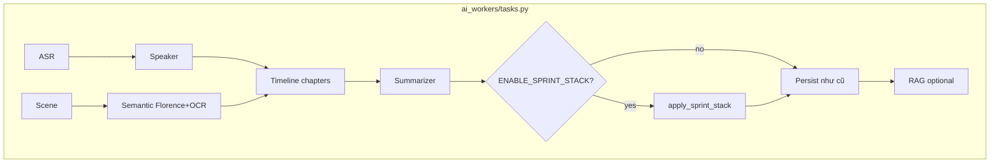

# Báo cáo triển khai Quality Gates & Sprint Stack

Tài liệu mô tả **vấn đề cần giải quyết**, **cách thuật toán hoạt động**, **kết quả thực nghiệm**, và **hướng triển khai** vào pipeline production (`ai_workers/tasks.py`).

Production đã port stack khuyến nghị vào `ai_workers/modules/fusion/quality_postprocess.py`
và wire trong `ai_workers/tasks.py` sau khi dựng chapters/keyframes.
Bật/tắt bằng `ENABLE_SPRINT_STACK` / `SPRINT_STACK` (mặc định: on + `recommended`).
Bản thí nghiệm gốc vẫn nằm trong `experiments/pipeline/`.

---

## 1. Bối cảnh & mục tiêu

Pipeline multimodal hiện tại gồm:

1. ASR (Faster-Whisper) → transcript  
2. Speaker diarization → utterances  
3. Scene detect + CLIP + Florence-2 + OCR → keyframes/captions  
4. Timeline → chapters  
5. LLM summarizer → summary  

Trên video TED thực tế, output baseline thường gặp:

| Hiện tượng | Ví dụ quan sát |
|---|---|
| Chapter quá ngắn | Chapter 1–3 giây, khó đọc / nhiễu outline |
| Keyframe dày / trùng | Nhiều KF gần nhau, coverage transcript thấp |
| Caption generic / hallucination | `Keyframe for Scene N`, hoặc caption Florence không khớp OCR |
| ASR / speaker thiếu kiểm soát | Không có confidence thật, stub speaker không được gate |

**Mục tiêu:** thêm lớp **quality gate + post-process sprint** sau các stage, cải thiện chất lượng xuất (chapters, keyframes, captions) mà **không đụng RAG indexing** trừ khi chủ đích.

---

## 2. Vấn đề giải quyết (Issues 5–8)

| Issue | Vấn đề | Giải pháp trong `quality_gates.py` |
|---:|---|---|
| **5 ASR** | Không có metric tin cậy; dễ tin transcript kém | `validate_audio_asr`: đo confidence (word prob), empty ratio, language mismatch → `quality_status`, `asr_weight`, `visual_dominant_fallback` |
| **6 Speaker** | Diarization không ổn định / stub 1 speaker | `validate_speaker_diarization` + `stabilize_unreliable_speakers` (collapse về 1 speaker khi `LOW`) |
| **7 Visual** | KF mờ / trùng; dedup thuần visual làm mất slide khác chữ | `smart_visual_quality_gate`: Laplacian blur + cosine embedding; **OCR-aware**: nếu visual giống nhưng OCR khác → giữ |
| **8 Caption** | Florence hallucination / không grounded OCR | `verify_and_ground_captions`: repetitive loop, grounding score caption∩OCR; soft/hard fallback |

Bổ sung post-process:

- `post_process_chapters`: gộp chapter `< min_dur` (mặc định 45s)  
- `post_process_utterances`: gộp utterance quá ngắn  

---

## 3. Sprint Stack — thuật toán chạy thế nào

Mã nguồn: `experiments/pipeline/sprints.py`  
Áp dụng tuần tự qua `apply_sprint_stack()`.


### 3.1 Sprint 1 — Chapter smoothing

**Vấn đề:** chapter 1–8 giây làm outline vỡ.

**Cách chạy:** gọi `post_process_chapters(min_dur_sec=45)` — gộp chapter ngắn vào chapter trước/sau, giữ title hợp lý.

**Kết quả điển hình:** 7→6 hoặc 9→8 chapters; `min_chapter` từ ~3s lên ≥45–60s.

### 3.2 Sprint 2 — Visual gate (runtime)

**Vấn đề:** frame mờ / trùng.

**Cách chạy:** Laplacian variance < 30 và OCR ngắn → drop; embedding cosine cao → dedup, trừ khi OCR khác rõ.

Offline cần ảnh keyframe trên disk; runtime sau semantic stage thì có đủ `ocr_text` / embedding.

### 3.3 Sprint 3 — OCR enrich caption

**Vấn đề:** caption kiểu `Keyframe for Scene N`.

**Cách chạy:** nếu caption generic và có `ocr_text` → thay bằng `Slide Text: {ocr}`.

Offline trên JSON cũ thường enrich = 0 (không lưu `ocr_text` riêng). Runtime pipeline thật thì OCR có sẵn.

### 3.4 Sprint 4 / 4v2 — Evidence-based keyframe prune

**Vấn đề:** quá nhiều KF trong cửa sổ thời gian; một số không có transcript.

**Evidence score** (rút gọn):

```
score =
  len(transcript)*0.02 + len(ocr)*0.08 + blur*0.001
  + importance*2 + (1.5 nếu caption không generic) + (1.0 nếu có transcript)
```

**S4:** trong mỗi cửa sổ `window_sec=45`, chỉ giữ tối đa `max_per_window=2` KF có evidence cao nhất; drop score thấp.

**S4v2:** sau prune, nếu chapter nào **không còn KF** → restore KF evidence tốt nhất trong chapter (hoặc lân cận ±15s).

### 3.5 Sprint 5 — Boost coverage

Tăng `importanceScore` cho KF nằm trong chapter (bonus nếu có transcript / caption tốt); gắn `keyframe_count` và flag gap.

### 3.6 Sprint 7 — Transcript caption fallback

Nếu caption vẫn generic và có transcript đã align →  
`Slide context: {snippet_transcript}`.

Rất hữu ích khi Florence trả caption kém nhưng ASR tốt.

### 3.7 Sprint 8 — Soft caption grounding

Chạy `verify_and_ground_captions` ở chế độ **soft**:

- Repetitive loop → thay caption đã verified  
- Hallucination + OCR đủ dài → `Slide Text: {ocr}`  
- Còn lại → **giữ caption gốc**, gắn `grounded_status=low_confidence_kept` (không xóa hàng loạt như hard gate)

Hard Gate 8 trên TED từng flag quá mạnh (13/14) nên soft mode an toàn hơn cho production.

### 3.8 Sprint 9 — Chapter visual hints

Gắn `visual_evidence_hint` vào mỗi chapter từ top-2 KF (theo evidence) trong khoảng thời gian chapter — hỗ trợ LLM / UI giải thích “vì sao chapter này có”.

### 3.9 Sprint 10 — Quality score & export_ready

Tính `pipeline_quality_score` (0–100) từ:

| Thành phần | Điểm tối đa |
|---|---:|
| Chapter min ≥ 45s | 25 |
| Transcript coverage | 25 |
| Visual hints đủ chapter | 15 |
| Ít/không caption generic | 15 |
| Có enrich caption | 10 |
| Đủ số KF (≥3) | 10 |

`export_ready = True` khi:

- `min_chapter ≥ 45s`  
- `transcript_coverage ≥ 0.85`  
- `generic_captions_remaining ≤ 1`

---

## 4. Stack khuyến nghị

| Tên | Stack | Khi dùng |
|---|---|---|
| **RECOMMENDED (cherry-pick)** | `S1 → S3 → S4v2 → S7` | Port production đầu tiên; ROI cao, rủi ro thấp |
| **FULL_STACK_S10** | + `S5 → S8soft → S9 → S10` | Metadata chất lượng, soft-flag, hint UI/LLM |
| **Gated full pipeline** | Gate 5–8 hard trong orchestrator | Thí nghiệm; hard caption gate có thể quá mạnh |

**Không khuyến nghị** port nguyên gated hard pipeline (Gate 8 hard) vào production ngay.

---

## 5. Kết quả thực nghiệm

### 5.1 Offline (replay JSON TED Blaise — không chạy lại model)

| Preset | Ch | Min ch | KF | Coverage |
|---|---:|---:|---:|---:|
| Baseline | 7 | ~1s | 15 | 86.7% |
| S1 | 6 | ≥45s | 15 | 86.7% |
| S1+S3+S4v2+S7 | 6 | ≥45s | 12 | **100%** |
| Full Sprint10 | 6 | ≥45s | 12 | **100%**, q=100, export_ready=True |

Verify: 5/5–12/12 checks PASS. Deep-verify: S4 drop audit hợp lệ (KF không transcript / window cap).

### 5.2 GPU real test (hybrid: Florence CUDA + Whisper CPU)

| Video | Variant | Ch | Min | KF | Cov | Wall | Quality | Export |
|---|---|---:|---:|---:|---:|---:|---:|---|
| Blaise (~7.6p) | Baseline | 7 | 2.9s | 15 | 66.7% | 201s | — | — |
| Blaise | Sprint10 | 6 | 60s | 13 | 76.9% | 201s | 84.2 | False* |
| Hans Rosling (~20p) | Baseline | 9 | 7.6s | 15 | 100% | 476s | — | — |
| Hans Rosling | Sprint10 | 8 | 92s | 14 | 100% | 476s | **90** | **True** |

\*Blaise chưa `export_ready` vì coverage transcript < 0.85 trên run GPU đó (ASR–scene align), không phải lỗi S1/S4.

**Lưu ý GPU:** ctranslate2 4.4 cần cuDNN 8 trong khi env có cuDNN 9 → Whisper GPU crash. Harness dùng hybrid: Florence/CLIP/OCR trên CUDA, Whisper trên CPU.

Output mẫu:

- `outputs/gpu_real_test_20260807_172433/`  
- `outputs/gpu_real_test_20260807_173258/`  
- `outputs/sprint_ladder_*`, `outputs/sprint_verify_*`, `outputs/sprint_deep_verify_*`

---

## 6. Cách triển khai

### 6.1 Hiện trạng

| Thành phần | Đường dẫn | Production? |
|---|---|---|
| **Sprint post-process (RECOMMENDED)** | `ai_workers/modules/fusion/quality_postprocess.py` | **Yes** — wired in `tasks.py` |
| Feature flags | `ENABLE_SPRINT_STACK`, `SPRINT_STACK`, `MIN_CHAPTER_SEC` | **Yes** — `ai_workers/core/config.py` |
| Backend summary mapping | `backend/app/api/v1/summaries.py` | Tolerates camel/snake after sprint |
| Quality gates (hard 5–8) | `experiments/pipeline/quality_gates.py` | No (experiment only) |
| Sprint algorithms (source) | `experiments/pipeline/sprints.py` | Source / offline |
| Orchestrator (gated / baseline) | `experiments/pipeline/orchestrator.py` | Experiment only |
| GPU real test | `experiments/scripts/run_gpu_real_test.py` | Experiment |
| Offline ladder / verify | `experiments/scripts/run_sprint_ladder.py`, … | Experiment |

### 6.2 Chạy thử nhanh

```powershell
# Offline ladder Sprint 1→10 (không cần GPU)
.venv-florence\Scripts\python.exe experiments\scripts\run_sprint_ladder.py --max-sprint 10

# Verify / deep-verify Sprint 10
.venv-florence\Scripts\python.exe experiments\scripts\verify_sprint_results.py --presets sprint10,baseline
.venv-florence\Scripts\python.exe experiments\scripts\deep_verify_sprints.py --variant sprint10

# Real GPU test (hybrid) trên video TED
.venv-florence\Scripts\python.exe experiments\scripts\run_gpu_real_test.py --stack sprint10 --video "D:\datasets\TEDLIUM\videos\Blaise_Agueray_Arcas.mp4"
```

### 6.3 Port vào production (`tasks.py`) — đề xuất

**Nguyên tắc:** post-process sau khi đã có `chapters` + `keyframes` (+ optional utterances), trước khi lưu DB / trả API. Bọc **feature flag**.

```text
process_video(...)
  → ASR / Speaker / Visual / Semantic / Timeline / Summarizer   # giữ nguyên
  → [FLAG] apply_sprint_stack(RECOMMENDED hoặc FULL_STACK_S10)
  → persist chapters / keyframes / export_meta
  → RAG index (không đổi schema bắt buộc)
```

**Bước triển khai khuyến nghị:**

1. **Copy / import** các hàm sprint từ `experiments/pipeline/sprints.py` sang module shared (ví dụ `ai_workers/modules/fusion/quality_postprocess.py`) — hoặc import có điều kiện từ experiments trong giai đoạn thử.  
2. Thêm env flag, ví dụ:
   - `ENABLE_SPRINT_STACK=0|1`
   - `SPRINT_STACK=recommended|sprint10`  
3. Port **RECOMMENDED trước:** `S1 + S3 + S4v2 + S7`.  
4. Sau A/B trên lecture VN: bật thêm S5, S8 soft, S9, S10 (metadata `export_ready`).  
5. Gate 5–8 hard: chỉ bật từng gate sau khi đo trên corpus thật; **đừng bật Gate 8 hard mặc định**.  
6. Không đổi contract RAG trừ khi thêm field optional (`visual_evidence_hint`, `pipeline_quality_score`).

**Checklist trước merge production:**

- [ ] Unit test sprint (đã có `experiments/scripts/test_sprints_unit.py`)  
- [ ] Offline verify trên ≥2 video TED  
- [ ] GPU real test ≥1 lecture VN + 1 TED  
- [ ] Flag tắt được ngay nếu regression  
- [ ] So sánh wall-time GPU vs baseline cũ (cùng device)

### 6.4 Điểm gắn trong luồng dữ liệu



---

## 7. Rủi ro & hạn chế

| Rủi ro | Mitigation |
|---|---|
| Gate 8 hard xóa quá nhiều caption | Dùng S8 soft; chỉ soft-flag |
| S4 prune làm chapter trống | Dùng **S4v2** (restore) |
| Offline S3 = 0 | Cần OCR runtime; không kết luận S3 từ JSON cũ |
| Whisper GPU cuDNN 8/9 | Hybrid Whisper CPU / Florence CUDA; hoặc nâng ctranslate2 hỗ trợ cuDNN9 |
| `export_ready=False` khi coverage thấp | Cải thiện align transcript↔scene; không hạ threshold vội |
| Chapter boundary làm tròn timestamp | Dùng float đủ precision + half-open `[start, end)` |

---

## 8. Kết luận

1. **Vấn đề cốt lõi đã xử lý:** chapter rác ngắn, KF thừa/thiếu bằng chứng, caption generic/hallucination, thiếu điểm chất lượng xuất.  
2. **Thuật toán:** evidence scoring + cửa sổ prune, OCR/transcript enrich, soft grounding, quality score.  
3. **Triển khai an toàn:** bắt đầu bằng stack `S1+S3+S4v2+S7` sau summarizer, có feature flag; mở rộng S5–S10 khi ổn định.  
4. **Thực nghiệm:** offline TED đạt coverage 100% / quality 100; GPU real Rosling `export_ready=True` (q=90); Blaise GPU cần cải thiện transcript coverage.

---

## 9. Tài liệu & mã liên quan

| Mục | Liên kết |
|---|---|
| Kiến trúc tổng thể | [ARCHITECTURE.md](./ARCHITECTURE.md) |
| Benchmark metrics | [BENCHMARK.md](./BENCHMARK.md) |
| Florence CPU/GPU | [florence-2-cpu-reproducibility.md](./florence-2-cpu-reproducibility.md) |
| Sprint code | `experiments/pipeline/sprints.py` |
| Quality gates | `experiments/pipeline/quality_gates.py` |
| Orchestrator | `experiments/pipeline/orchestrator.py` |

---

*Cập nhật: 2026-08-07 — dựa trên offline Sprint ladder/verify và GPU real tests Blaise + Hans Rosling.*
