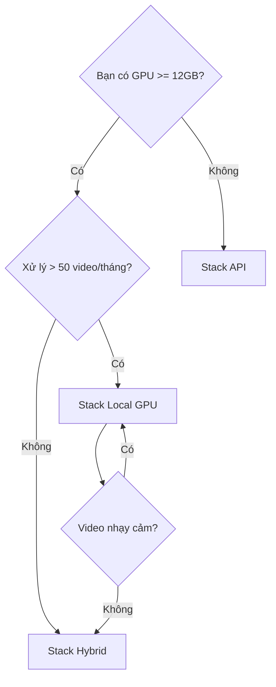

# So sánh stack công nghệ — Local GPU vs Cloud API

Tài liệu so sánh chi tiết hai hướng triển khai cho **multimodal-lecture-summarizer**.

---

## 1. Tổng quan hai stack

| Tiêu chí | **Local GPU** (`stack_local_gpu.yaml`) | **Cloud API** (`stack_api.yaml`) |
|----------|----------------------------------------|----------------------------------|
| **Đối tượng** | Lab, on-premise, video nhạy cảm | Prototype nhanh, không có GPU |
| **Chi phí cố định** | GPU + điện | $0 cố định |
| **Chi phí biến đổi** | Thấp (sau khi mua GPU) | ~$1–8 / video 90 phút |
| **Latency 90 phút** | ~12–25 phút (RTX 4090) | ~8–15 phút (song song API) |
| **Privacy** | Cao — data không rời máy | Thấp — gửi audio/frame lên cloud |
| **Setup** | Phức tạp (CUDA, models) | Đơn giản (API keys) |
| **Chất lượng ASR** | WhisperX large-v3 ⭐⭐⭐⭐ | AssemblyAI / GPT-4o ⭐⭐⭐⭐ |
| **Chất lượng VLM** | BLIP-2 / LLaVA ⭐⭐⭐ | GPT-4o vision ⭐⭐⭐⭐⭐ |

---

## 2. So sánh theo từng module

### 2.1 Audio (ASR)

| | Local: WhisperX large-v3 | API: AssemblyAI | API: Deepgram Nova-3 | API: OpenAI gpt-4o-transcribe |
|--|--------------------------|-----------------|----------------------|-------------------------------|
| **WER bài giảng EN** | 8–12% | 7–11% | 8–12% | 6–10% |
| **WER tiếng Việt** | 15–25% | 12–20% | 15–22% | 10–18% |
| **Word timestamps** | ✅ Tốt (forced align) | ✅ Có | ✅ Có | ⚠️ Hạn chế |
| **Chi phí / giờ audio** | ~$0 (GPU) | ~$0.37 | ~$0.26 | ~$0.36 |
| **VRAM / RAM** | ~6–10 GB | — | — | — |
| **Tốc độ (RTX 4090)** | ~8–12× realtime | ~15× (network) | ~20× | ~10× |
| **Hallucination** | Trung bình (VAD giúp) | Thấp | Thấp | Thấp |
| **Offline** | ✅ | ❌ | ❌ | ❌ |

**Khuyến nghị:**
- **Local:** WhisperX khi có GPU ≥12GB, cần timestamp chính xác, volume lớn
- **API:** AssemblyAI khi cần ASR + diarization bundled, setup nhanh

---

### 2.2 Speaker (Diarization)

| | Local: pyannote 3.1 | API: AssemblyAI (bundled) | API: pyannote precision-2 (cloud) |
|--|---------------------|---------------------------|-----------------------------------|
| **DER AMI mic xa** | 15–23% | 12–18% | 10–15% |
| **Overlap speech** | ⚠️ Yếu | ⚠️ Yếu | Tốt hơn |
| **Speaker ID (tên)** | ❌ Cần enrollment | ❌ | ❌ |
| **Chi phí / giờ** | ~$0 | Gộp trong ASR | ~$0.50 riêng |
| **License** | HF token + accept | API key | Commercial |

**Khuyến nghị:**
- Bài giảng 1 giảng viên + Q&A: diarization **tùy chọn** (có thể skip)
- Seminar nhiều người: dùng AssemblyAI bundled hoặc pyannote local

---

### 2.3 Visual (Scene + Keyframe)

| | Local: PySceneDetect | Local: TransNetV2 | API: không cần |
|--|----------------------|-------------------|----------------|
| **Chi phí** | $0 (CPU/GPU nhẹ) | $0 | — |
| **F1 cut detection** | 85–92% | 94–97% | — |
| **Tốc độ 90 phút** | ~1–2 phút | ~3–5 phút | — |
| **VRAM** | 0 | ~2 GB | — |

**Khuyến nghị:** Luôn chạy **local** — nhẹ, không cần API. TransNetV2 khi slide transition mờ.

---

### 2.4 Semantic (OCR + Vision)

| | Local: PaddleOCR | Local: CLIP + BLIP-2 | API: Google Vision OCR | API: GPT-4o vision |
|--|------------------|----------------------|------------------------|---------------------|
| **OCR slide in** | 93–98% char acc | — | 95–99% | 90–95% (kèm hiểu ngữ cảnh) |
| **OCR handwriting** | 60–75% | — | 65–80% | 70–85% |
| **Caption diagram** | BLIP ⭐⭐⭐ | LLaVA ⭐⭐⭐⭐ | — | GPT-4o ⭐⭐⭐⭐⭐ |
| **Chi phí 90 phút** | ~$0 | ~$0 (GPU time) | ~$0.50–1.50 | ~$2–6 (theo số frame) |
| **VRAM** | ~2 GB | BLIP ~6 GB, LLaVA ~14 GB | — | — |
| **Latency / frame** | ~0.3s | BLIP ~2s, LLaVA ~5s | ~0.5s | ~1–2s |

**Khuyến nghị:**
- **Local MVP:** PaddleOCR + CLIP (alignment), skip caption nếu OCR đủ
- **API chất lượng cao:** GPT-4o vision batch 3 frame/phút (~270 frame/90 phút)

---

### 2.5 Text (LLM Summarization)

| | Local: Ollama Qwen2.5 14B | Local: Llama 3.1 70B | API: GPT-4o-mini | API: GPT-4o | API: Claude 3.5 Sonnet |
|--|---------------------------|----------------------|------------------|-------------|------------------------|
| **Chất lượng summary** | ⭐⭐⭐ | ⭐⭐⭐⭐ | ⭐⭐⭐⭐ | ⭐⭐⭐⭐⭐ | ⭐⭐⭐⭐⭐ |
| **Grounding** | Trung bình | Tốt | Tốt | Rất tốt | Rất tốt |
| **Context window** | 32K | 128K | 128K | 128K | 200K |
| **Chi phí summary 90 phút** | ~$0 | ~$0 (GPU 48GB+) | ~$0.30–0.80 | ~$2–5 | ~$2–5 |
| **VRAM** | ~10 GB (14B Q4) | ~40 GB | — | — | — |
| **Tiếng Việt** | Tốt | Tốt | Tốt | Rất tốt | Rất tốt |

**Khuyến nghị:**
- **Dev/test:** GPT-4o-mini (rẻ, đủ tốt)
- **Production chất lượng:** GPT-4o hoặc Claude 3.5
- **Air-gapped:** Qwen2.5 14B qua Ollama

---

### 2.6 Timeline (RAG)

| | Local: ChromaDB + MiniLM | API: OpenAI embeddings |
|--|--------------------------|------------------------|
| **Chi phí** | $0 | ~$0.01–0.05 / video |
| **Hit@5 retrieval** | 70–82% | 75–88% |
| **Privacy** | Cao | Thấp |

---

## 3. Ma trận quyết định



---

## 4. Ba stack đề xuất

### Stack A — Full Local GPU (chi phí thấp, volume cao)

```yaml
# configs/stack_local_gpu.yaml
audio: whisperx large-v3
speaker: pyannote 3.1
visual: scenedetect
semantic: paddleocr + clip + blip-2
text: ollama qwen2.5:14b
rag: chromadb + minilm
```

| GPU | VRAM cần | Chi phí ước tính |
|-----|----------|------------------|
| RTX 3060 12GB | 12 GB (tight) | Chạy tuần tự, không BLIP |
| RTX 4070 Ti Super 16GB | 16 GB | Đủ cho BLIP-2 |
| RTX 4090 24GB | 24 GB | Full pipeline song song |

**Tổng chi phí / video 90 phút:** ~$0.15 điện + $0 API

---

### Stack B — Full Cloud API (setup nhanh, chất lượng cao)

```yaml
# configs/stack_api.yaml
audio: assemblyai (ASR + diarize)
visual: scenedetect (local CPU)
semantic: gpt-4o-mini vision
text: gpt-4o
rag: openai embeddings
```

**Tổng chi phí / video 90 phút:** ~$4–8

---

### Stack C — Hybrid (khuyến nghị cho production)

```yaml
# Kết hợp tốt nhất
audio: whisperx (local)           # timestamp chính xác, miễn phí
speaker: pyannote (local)
visual: scenedetect (local CPU)
semantic: paddleocr (local) + gpt-4o-mini vision (chỉ slide phức tạp)
text: gpt-4o-mini (API)
rag: chromadb (local)
```

| Thành phần | Local / API | Lý do |
|------------|-------------|-------|
| ASR + Diarize | Local | Volume cao, timestamp |
| Scene + OCR | Local | Nhẹ, không cần API |
| Vision caption | API (selective) | Chỉ frame OCR trống hoặc diagram |
| Summary | API | Chất lượng tốt, rẻ với mini |
| RAG | Local | Privacy, không tốn phí |

**Tổng chi phí / video 90 phút:** ~$1–2.5

---

## 4. Bảng so sánh tổng hợp (90 phút video)

| Metric | Local GPU (4090) | API Full | Hybrid |
|--------|------------------|----------|--------|
| **Setup time** | 2–4 giờ | 15 phút | 1–2 giờ |
| **Processing time** | 12–20 phút | 8–15 phút | 10–18 phút |
| **Chi phí / video** | ~$0.15 | ~$4–8 | ~$1–2.5 |
| **WER (EN lecture)** | 9–12% | 7–10% | 9–12% |
| **Summary quality** | ⭐⭐⭐ | ⭐⭐⭐⭐⭐ | ⭐⭐⭐⭐ |
| **Privacy** | ⭐⭐⭐⭐⭐ | ⭐⭐ | ⭐⭐⭐⭐ |
| **Scale 100 video/tháng** | $15 điện | $400–800 | $100–250 |
| **GPU yêu cầu** | RTX 4070+ | Không | RTX 3060+ |

---

## 5. Yêu cầu phần cứng Local

| Component | Minimum | Recommended | Notes |
|-----------|---------|-------------|-------|
| GPU VRAM | 12 GB | 24 GB | WhisperX + pyannote ~8GB peak |
| RAM | 16 GB | 32 GB | OCR batch, chroma index |
| Storage | 50 GB | 200 GB | Model cache ~15GB |
| CPU | 6 cores | 8+ cores | FFmpeg, scene detect |
| CUDA | 11.8+ | 12.x | PyTorch 2.1+ |

**Model size trên disk:**

| Model | Size |
|-------|------|
| Whisper large-v3 | ~3 GB |
| wav2vec2 align | ~1 GB |
| pyannote 3.1 | ~1.5 GB |
| PaddleOCR vi+en | ~0.5 GB |
| CLIP ViT-L-14 | ~1 GB |
| BLIP-2 2.7B | ~5 GB |
| **Tổng** | **~12 GB** |

---

## 6. API keys & biến môi trường

```bash
# .env.example
# Local
HF_TOKEN=hf_...                    # pyannote model access
CUDA_VISIBLE_DEVICES=0

# API stack
OPENAI_API_KEY=sk-...
ASSEMBLYAI_API_KEY=...
DEEPGRAM_API_KEY=...
GOOGLE_APPLICATION_CREDENTIALS=... # Vision OCR (optional)
ANTHROPIC_API_KEY=...              # Claude (optional)
```

---

## 7. Kết luận & khuyến nghị

| Tình huống | Stack |
|------------|-------|
| Sinh viên / nghiên cứu, có GPU | **Local GPU** |
| Startup prototype 1–2 tuần | **API Full** |
| Production, 10–100 video/tháng | **Hybrid** ⭐ |
| Video y tế / pháp lý / nội bộ | **Local GPU** (bắt buộc) |
| Không có GPU, budget thấp | **API** với GPT-4o-mini + AssemblyAI |

File config tương ứng:
- `configs/stack_local_gpu.yaml`
- `configs/stack_api.yaml`
- Tạo `configs/stack_hybrid.yaml` khi triển khai phase P1
