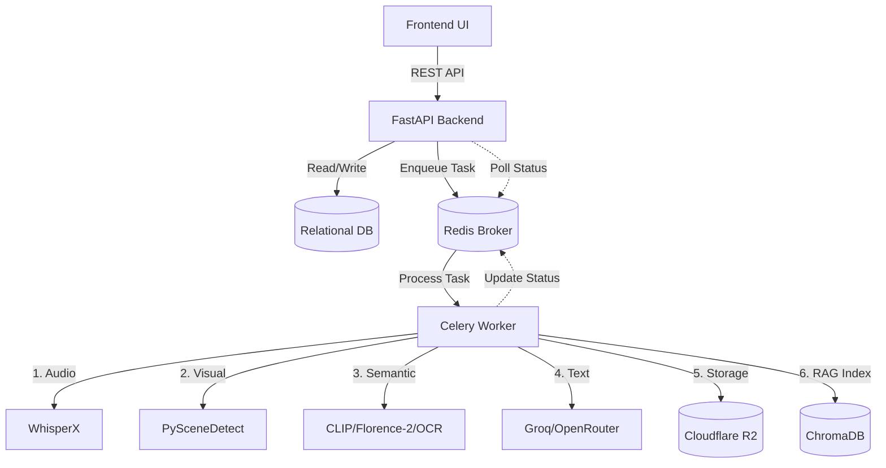
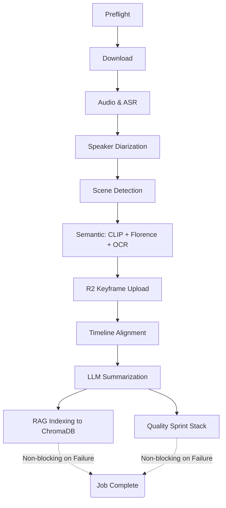

# Current System Architecture

This document outlines the current architecture, processing flows, and actual implementation details of the Multimodal Video Summarization System based on the provided codebase and runtime logs.

> **Note**: This document describes the system *as it currently exists*, highlighting confirmed behavior, resource constraints, and opportunities for optimization.

---

## 1. System Overview

The system is a monolithic, asynchronous multimodal processing pipeline driven by a frontend UI.

- **Frontend**: React (Vite) application utilizing TailwindCSS. Communicates via REST APIs.
- **Backend API**: FastAPI framework handling HTTP requests, standardizing responses (BaseDTO), and managing database interactions.
- **Worker / Task Queue**: Celery with Redis broker (`ai_workers`). Executes heavy AI pipelines.
- **Database**: Relational DB (PostgreSQL/SQLite via SQLAlchemy) for users, videos, jobs, summaries, and scenes.
- **Vector Database**: ChromaDB for RAG indexing and search.
- **Object Storage**: Cloudflare R2 (or a local mock directory fallback) for storing downloaded videos and extracted keyframes.
- **External AI/LLMs**: Groq (e.g., `llama-3.1-8b-instant`) or OpenRouter models for generating summaries. yt-dlp for remote video downloads.

### High-Level Architecture Diagram

---

## 2. End-to-End Video Processing Flow

The entire lifecycle of a video runs inside a single Celery task: `ai_workers.process_video`.

### Stages (Sequential Execution)

1. **Preflight Check**
   - **Purpose**: Verify available system RAM before starting.
   - **Implementation**: `ensure_process_memory_available`.
   - **Behavior**: Fails the entire job if available RAM is below 3072 MB.

2. **Download**
   - **Purpose**: Fetch video to a local temp file.
   - **Implementation**: Uses `yt-dlp` for YouTube, `boto3` for R2, or `requests` for standard HTTP. Optionally uploads remote videos to R2.

3. **Audio Extraction (`audio`)**
   - **Purpose**: Extract audio track and perform ASR.
   - **Model**: `AudioTranscriber` (WhisperX).
   - **Output**: Full transcript text and segment timestamps.

4. **Speaker Diarization (`speaker`)**
   - **Purpose**: Identify different speakers.
   - **Model**: `SpeakerDiarizer` (Pyannote).
   - **Output**: Utterances mapped to speaker IDs.

5. **Visual Processing (`visual`)**
   - **Purpose**: Detect scene changes and extract slide keyframes.
   - **Model**: `SceneDetector` (PySceneDetect).
   - **Output**: Array of scenes and keyframe image paths.

6. **Semantic Analysis (`semantic`)**
   - **Purpose**: Filter redundant slides, generate image captions, and extract text from slides.
   - **Models**: CLIP (K-Means clustering), Florence-2 (captioning), PaddleOCR (text extraction).
   - **Note**: Florence-2 is skipped if RAM < 6144 MB.

7. **Storage Upload (`storage`)**
   - **Purpose**: Upload keyframes to Cloudflare R2.
   - **Implementation**: Synchronous `boto3` upload inside the Celery task.

8. **Timeline Alignment (`timeline`)**
   - **Purpose**: Align utterances with slide scenes and detect chapters.
   - **Model**: `TimelineBuilder`.
   - **Output**: Temporal boundaries for chapters.

9. **Summarization (`text`)**
   - **Purpose**: Generate the final grounded summary and video title using an LLM.
   - **Model**: `Summarizer` (Groq/OpenRouter).
   - **Output**: Video Title, Summary Text, Refined Chapters.

10. **RAG Indexing (`rag`)**
    - **Purpose**: Build multimodal chunks for Chat / Q&A.
    - **Implementation**: Synchronously groups utterances and slide texts into 25-second windows, embedded and stored in ChromaDB.

11. **Quality Postprocess (Optional)**
    - **Purpose**: Refine outputs if the sprint stack is enabled.
    - **Implementation**: `apply_quality_postprocess`.

---

## 3. Actual Dependency Graph

Despite documentation suggesting parallel processing, the actual implementation runs strictly sequentially to conserve GPU VRAM.

**Key Discoveries**:
- **Strictly Sequential**: Audio must finish and unload from VRAM before Visual starts.
- **RAG & Quality are Non-blocking**: If RAG indexing or the Quality Sprint fails, the pipeline catches the error and still marks the video as successful.
- **R2 Upload**: R2 image upload synchronously blocks the Timeline and LLM generation.

---

## 4. Processing State / Job Lifecycle

### Granular Job State
- Celery Task updates its `state` to `PROGRESS` using `self.update_state()`.
- Metadata includes: `stage` (e.g., 'audio', 'visual'), `progress` (0-100), and `logs` (array of recent terminal outputs).

### Backend Synchronization
- FastAPI runs a background loop (`poll_celery_jobs`) every 10 seconds.
- It queries active jobs from the relational DB, checks their Celery state, and translates `PROGRESS` payloads to the DB `Job` model.
- When Celery reaches `SUCCESS`, the backend saves all artifacts (`Summary`, `VideoScene`) to the database in one large transaction.

### Frontend Consumption
- The frontend knows processing is complete when the API returns a job `status` of `COMPLETED` or `FAILED`.
- The frontend relies on the backend's synchronized DB state, typically polling the `/api/v1/jobs/{job_id}` endpoint.

---

## 5. Data Flow

Artifacts flow sequentially through the pipeline, aggregating into a massive `result` dictionary returned by Celery.

- **`audio_result`**: Generated by WhisperX. Contains raw text and `segments`. Passed to Speaker Diarizer.
- **`utterances`**: Generated by Pyannote. Array of `{start, end, text, speaker}`. Used by Timeline, Summarizer, and RAG.
- **`visual_result` & `filtered_scenes`**: Detected by PySceneDetect. Augmented by CLIP/Florence-2/PaddleOCR with `caption` and `ocr_text`.
- **`chapters`**: Initial boundaries generated by TimelineBuilder. Passed to the LLM.
- **`result` (Celery Output)**: The final dictionary payload containing `summary`, `chapters`, `keyframes`, `transcript_segments`, and `scenes`.

Once Celery returns `result`, `sync_job_status` consumes it to:
1. Update `Video` metadata (duration, title).
2. Create a `Summary` DB record.
3. Create multiple `VideoScene` DB records.
4. Push RAG chunks to ChromaDB.

---

## 6. Resource Management

The system operates under tight hardware resource constraints.

### Constraint: Strict Sequential Execution
The current development machine lacks sufficient resources to run Audio and Visual pipelines concurrently.
- **Behavior**: The pipeline explicitly loads a model, processes the data, deletes the model object (`del model`), and calls `release_worker_resources()` which triggers garbage collection and `torch.cuda.empty_cache()` before loading the next model.
- **Status**: This is an intentional architectural choice, not a bug.

### Identified Bottlenecks & Leakage
- **Memory Leakage**: Logs indicate that available RAM drops significantly after the first video processing cycle and fails to recover fully, causing subsequent Celery jobs to crash during the Preflight check (Out of Memory).
- **Graceful Degradation**: If available RAM is below 6144 MB during the Semantic stage, Florence-2 captioning is skipped.

---

## 7. RAG Architecture

- **When RAG starts**: Executed at the very end of the Celery pipeline, after LLM Summarization.
- **Chunk Generation**: Iterates over the transcript in ~25-second windows.
- **Multimodal Merging**: For each window, it combines speech text, overlapping OCR text, and visual captions into a single text document (`[MM:SS] Lời giảng: ... | Văn bản trên slide: ... | Mô tả hình ảnh: ...`).
- **Storage**: Chunks are sent to `chromadb_service` along with metadata (`video_id`, `timestamp`, `keyframe_url`).
- **Failure Handling**: Wrapped in a `try-except` block. RAG failure does **not** fail the video job.

---

## 8. Critical Path vs Background Work

### Critical Path (Blocks User Value)
- Preflight
- Video Download
- Audio Extraction & Diarization
- Visual Scene Detection & Keyframing
- Semantic K-Means Filtering & OCR
- Timeline Alignment
- LLM Summarization

### Background / Async Candidate (Could be Deferred)
- **Cloudflare R2 Keyframe Upload**: Currently runs synchronously mid-pipeline. Could be deferred to run in the background.
- **ChromaDB RAG Indexing**: Runs at the end of the pipeline, but synchronously blocks the final `SUCCESS` state of the Celery task. Could be completely decoupled.
- **Florence-2 Captioning**: Heavy, optional semantic enrichment that could theoretically be deferred.

---

## 9. Performance & Reliability Observations

### Confirmed Issues
1. **Memory Leak / Incomplete Cleanup**: The system fails to process sequential jobs because memory is not fully released back to the OS after a job finishes.
2. **Synchronous R2 Uploads**: Network I/O to Cloudflare R2 blocks the heavy AI pipeline thread.
3. **High Overhead Job State Sync**: The backend polls Celery every 10 seconds for all active jobs and performs heavy DB writes on completion.

### Potential Issues
- **Single Point of Failure**: Because everything runs in one massive Celery task, an unexpected network timeout during the final Groq LLM call will fail the entire job, losing all the expensive Audio/Visual extraction work.
- **Temporary Files**: `temp_*.mp4` files are cleaned up in a `finally` block, but unexpected hard crashes (e.g., OOM kill) might leave zombie files in storage.

---

## 10. Known Constraints

1. **RAM Hard Floor**: Processing strictly requires `3072 MB` free RAM to start.
2. **Florence-2 RAM**: Requires `6144 MB` free RAM; otherwise, visual captioning is skipped.
3. **Sequential Constraint**: Audio and Visual pipelines cannot be parallelized due to VRAM limitations.
4. **Third-Party API Dependency**: Heavily relies on Groq/OpenRouter availability for summarization.

---

## 11. Architecture Questions / Unknowns

- **Exact memory lifecycle in `release_worker_resources`**: It is unclear from `tasks.py` alone if `gc.collect()` and `cuda.empty_cache()` are sufficient, or if models are maintaining persistent references in global state. Next step: Inspect `ai_workers/core/resource_cleanup.py`.
- **RAG Chunk Embeddings Model**: It is unclear which exact embedding model ChromaDB is using (default sentence-transformers vs custom). Next step: Inspect `app/services/chromadb.py`.
- **Job Status Polling Impact**: It is unclear how polling a large number of active jobs every 10s affects DB performance. Next step: Check `Job` table indexing.

---

# Executive Summary

- **Current Architecture**: A monolithic Celery task orchestrating sequential AI models (WhisperX, Pyannote, PySceneDetect, CLIP, PaddleOCR, Groq). Resulting artifacts are synchronized into PostgreSQL/SQLite and ChromaDB by FastAPI.
- **Top 5 Confirmed Issues**:
  1. Memory leaks between Celery jobs causing `Out of Memory` Preflight failures on subsequent runs.
  2. The massive single-task pipeline means any small network error (R2/LLM) fails the entire expensive run.
  3. R2 Image uploads happen synchronously, blocking GPU/CPU resources.
  4. RAG indexing synchronously blocks the final `SUCCESS` state of the job.
  5. Florence-2 is frequently skipped due to high RAM requirements (>6GB).
- **Top 5 Areas for Investigation**:
  1. Root cause of memory failing to return to the OS (Python GC vs PyTorch Caching).
  2. Possibility of splitting the pipeline into a Celery DAG/Chord to save partial progress.
  3. Moving R2 uploads to background threads.
  4. Moving RAG indexing out of the critical path.
  5. Optimizing FastAPI polling frequency/efficiency.
- **Current Resource Constraints**: The system is intentionally sequential due to GPU VRAM limits. Do not parallelize Audio and Visual processing on the same worker.
- **Architectural Fact to Preserve**: Preflight RAM checks and graceful degradation (skipping Florence-2) are necessary defense mechanisms for the current hardware.
