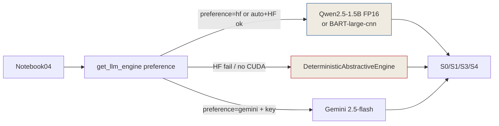

# Phase 2: Alternative Engine Design

## Overview
Choose the offline-first engine stack and define the `get_llm_engine` factory contract so `04` never hits Gemini rate-limit by default, yet Gemini remains opt-in.

## Requirements
- Functional: `get_llm_engine(preference="auto"|"hf"|"deterministic"|"gemini")` returns a working engine without 429; `preference="auto"` = HF if available, else deterministic; `gemini` only when key present and explicitly requested.
- Non-functional: <60s model load on T4, <5s per summary call, D-T08 budget unchanged, single source of truth (DRY).

## Architecture


**Design decisions:**

1. **Primary: HuggingFace local** — `Qwen/Qwen2.5-1.5B-Instruct` (default) because `04` prompts are instruction-style (`Summarize Chapter X...`). Fallback to `facebook/bart-large-cnn` if VRAM <6GB or user wants faster CNN summarizer. Both fit T4 15GB in FP16 with `device_map="auto"`.
2. **Guaranteed fallback: Enhanced Deterministic** — improve current `DeterministicAbstractiveEngine:58` from 5-sentence heuristic to **SBERT-centrality + keyword scoring** (re-use `DenseEmbedder` from `retrieval_qa.py` if SBERT available, else TF-IDF). Must produce chapter-structured output matching `S3/S4` bullet format.
3. **Gemini remains opt-in** — `preference="gemini"` still works when `GEMINI_API_KEY` set; add `RateLimitBackoff` (max 2 retries, exponential 2s/4s) and on final 429 **auto-fallback to HF/Deterministic with warning** instead of returning empty string.
4. **Config surface:** Single `LLM_PREFERENCE` env/cell var in `04`:
   ```python
   LLM_PREFERENCE = os.getenv("LLM_PREFERENCE", "auto")  # auto | hf | deterministic | gemini
   llm = get_llm_engine(preference=LLM_PREFERENCE)  # all summarizers share this instance
   ```

## Related Code Files
- Modify: `benchmarks/models/llm_engine.py` (extend `HuggingFaceLLMEngine`, `DeterministicAbstractiveEngine`, `get_llm_engine` factory, add `RateLimitBackoff`)
- Modify: `benchmarks/models/summarization.py` (inject `llm_engine` param already exists — ensure `04` passes it; no logic change)
- Modify: `experiments/notebooks/04_phase4_hierarchical_summarization.ipynb` (cell 4 config + cell 6 summarizer instantiation)
- Create: (none) unless `llm_engine.py` exceeds 250 LOC → split `hf_engine.py` (YAGNI: keep in one file until then)

## Implementation Steps
1. Define engine selection matrix (table: preference × key present × HF available × device → chosen engine).
2. Specify `HuggingFaceLLMEngine` improvements:
   - `model_id` param default `Qwen/Qwen2.5-1.5B-Instruct`, alt `facebook/bart-large-cnn` for `preference="hf-bart"`.
   - `device` auto-detect: `cuda` if `torch.cuda.is_available()` else `cpu`; `torch_dtype=torch.float16` on cuda.
   - `generate` must handle both instruction chat format (Qwen) and seq2seq (BART) — branch on `model_id`.
   - Add `HF_HOME` env support and `trust_remote_code=False`.
3. Specify `DeterministicAbstractiveEngine` v2:
   - If `sbert_available`: embed sentences via `all-MiniLM-L6-v2`, score by cosine to centroid of lecture.
   - Else: TF-IDF fallback (current keyword scoring).
   - Ensure output matches `SummaryResult` bullet style (`**Chapter N [ts]**: ...`).
4. Specify `get_llm_engine(preference)` contract with pseudo:
   ```python
   def get_llm_engine(preference="auto"):
       # auto: try HF -> deterministic; hf: raise if HF unavailable; gemini: try Gemini else fallback with warning
       # Never raise 429 to caller.
   ```
5. Document `SummarizerConfig` unchanged; `BaseSummarizer.__init__(config, llm_engine=...)` injection is the only wiring needed in `04`.

## Success Criteria
- [ ] Selection matrix approved (covers auto/hf/deterministic/gemini × key/no-key × HF ok/fail).
- [ ] HF engine spec includes model_id, device, dtype, prompt format, and `HF_HOME` caching.
- [ ] Deterministic v2 spec includes SBERT-centrality upgrade path.
- [ ] `get_llm_engine` contract pseudo-code reviewed and matches `BaseLLMEngine.generate` signature.

## Risk Assessment
- **Risk:** Qwen 1.5B on CPU (no GPU) is too slow (>30s/call × 20 calls = 10min). **Mitigation:** On CPU, design says `auto` must skip HF and use deterministic directly; log `HF skipped on CPU`.
- **Risk:** Two HF models (Qwen + BART) doubles download. **Mitigation:** Default only Qwen; BART is alternative, not both.
- **Risk:** Current `llm_engine.py:45` loads model at `__init__` — cold start blocks notebook. **Mitigation:** Keep lazy load but add `HF_ENGINE_CACHE` singleton so all S0/S1/S3/S4 share one model instance.

<!-- Updated: Validation Session 2 - Qwen2.5-1.5B locked as default (BART alternative only), auto→deterministic on CPU, no Drive cache -->
**Validation Update (2026-08-31):** Confirmed `Qwen2.5-1.5B-Instruct` as primary for `preference=auto` (BART kept as alternative `hf-bart` only). `auto` on CPU must skip HF and use deterministic with warning. No Drive cache (KISS, 60s reload accepted).

