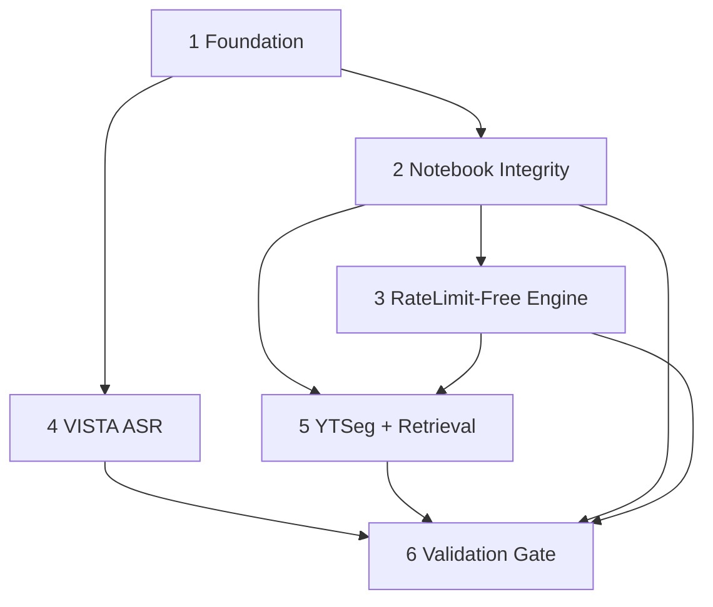

# Unified Scientific Benchmark — Multimodal Lecture Understanding, Summarization & Retrieval

## Overview

**Hợp nhất 4 plans rời rạc thành 1 execution plan duy nhất.** Trước khi hợp nhất, repo có 4 plans chồng chéo, phụ thuộc lẫn nhau (`blockedBy` vòng) và cùng chỉnh `03/04/05 notebooks + benchmarks/models/llm_engine.py + benchmarks/core/feature_store.py`:

| Plan cũ | Vai trò | Trạng thái |
|---------|---------|------------|
| `260830-1917-scientific-benchmark` | Scientific framework — master thesis statement, C1-C4 falsifiable claims, C5/C6 architectures, RQ1-RQ4 benchmark matrix, D-T01…D-T14 + D-S01…D-S04, dataset gates, 26-week timeline | Non-ck plan (8 docs) |
| `260831-fix-notebooks-3-5` | Fix `03/04/05` notebooks khỏi `torch.randn`/template-fake sang real `cached_features/*.pt` + rebuild `targets` từ `ground_truth_boundaries` + `checkpoints/c5_real.pt` | `pending` 4 phases |
| `260831-ratelimit-free-summarization` | Thay Gemini (`~30 calls/run` → 429) bằng `Qwen2.5-1.5B` singleton + `Deterministic` v2 + retry fallback, `LLM_PREFERENCE=auto` | `completed` 4 phases (code đã ở `4013290`) |
| `260831-benchmark-tdd-hardening` | Scale YTSeg `20→300`, VISTA `300` self-ASR, `04/05` chunked-cache resume, full EduVidQA 5,252 QA offline | `pending` 4 phases |

Unified plan giữ **toàn bộ scientific rigor** của `260830` (equal-budget `D-T08`, Holm `D-T07`, C5/C6 frozen `D-T02`, HF local-SSD `D-T09`) làm **ràng buộc xuyên suốt**, đồng thời gom 3 hardening/fix plans thành 4 execution phases có thứ tự.

**Thesis statement (từ `00-master-plan.md:10`):**

> Can a compute-efficient, temporally structured multimodal representation improve lecture chaptering, hierarchical summarization and evidence-grounded QA over transcript-only baselines under controlled compute and context budgets?

**Architecture (frozen):**

```text
Lecture video ─┬─ transcript + acoustic (whisper-small, 32d)
               ├─ frames → DINOv2 ViT-S/14 (384d)
               └─ OCR → PaddleOCR v3 ch_PP-OCRv4 conf≥0.6 (384d)
                         │
                         ▼
               Temporal multimodal encoder
               [C5: 4-layer cross-attn transformer 256h,
                text/vis/ocr → shared 256, 3 boundary tokens, BCE]
                         │
                         ├── boundary head ──► chapters
                         ▼
               Video → chapter → scene → evidence hierarchy
                         ├──► hierarchical summarization (S0-S4) + citations
                         └──► retrieval/QA (Q0-Q3) + timestamps
                                        ▼
                              quality / latency / VRAM (E1-E4)
Compact VLM baseline C7/E4: Qwen3-VL-4B-Instruct FP16 (HF commit pinned W1, D-T01/D-T03)
```

**Contributions C1-C4 (falsifiable, `00-master-plan.md:45`):** C1 chaptering `C5>C1` collar F1±3s; C2 summarization `S3>S1` human factuality; C3 retrieval `Q2/Q3>Q0` evidence; C4 Pareto `E3` dominates ≥2 metrics. Negative = valid.

## Goals

1. **Framework đóng băng:** Toàn bộ `D-T01…D-T15` + `D-S01…D-S04` (E4/C7 = Qwen3-VL-4B FP16, C5/C6 frozen, DINOv2+PaddleOCR, TransNetV2, ytseg→VISTA→TIB fallback tier, budget `32k/512/200f`, HF local-SSD) được thực thi, không drift. **`D-T15 real-data-only` là ràng buộc cứng.**
2. **Data integrity (P2):** `01/02/03/04/05` notebooks + `run_rq2/rq3_benchmark.py` **100% real data** — hết synthetic/answer-leak/template-OCR/randn mock; `01` chỉ real EduVidQA/VT-SSum/TIB/YTSeg, `02` thay `np.random.randn` embeddings & `np.random.uniform` C2–C6 bằng real `cached_features/*.pt` + real `C1–C6` inference; `03` RQ1 train trên `targets` rebuild từ `ground_truth_boundaries` (guard), `checkpoints/c5_real.pt` persisted; `d_ac 64→32`.
3. **Rate-limit-free (P3):** `04`/`05` default `LLM_PREFERENCE=auto` → `Qwen2.5-1.5B` singleton else `Deterministic` v2, Gemini `retry 2× + fallback` never `""`, 0 Gemini khi `auto`, `04` `100 vids <30 min` T4, `outputs/phase4_cache` resume survives Colab 12h kill, `D-T08` strict.
4. **Scale (P4+P5):** YTSeg lecture/science `n=300` (over-fetch 500, `frozen_manifest_v2.json` 0 leakage) + VISTA `300` self-ASR `whisper-small` + full EduVidQA `5,252` QA offline (`all-MiniLM-L6-v2` SBERT+BM25, `top_k=3`), feature_store sharded to Drive, `HF_HOME=/root/.cache/huggingface`.
5. **Gate (P6):** Holm within RQ (4+4+3 tests), bootstrap 95% CI, Cohen d/Hedges g, per-video predictions retained, D-T10 power pilot back-solve `n` cho `d=0.3/0.5` @80%, reproducibility package + verification report. **Gate fail nếu phát hiện mock trong research path (grep D-T15).**

## Non-Goals

- Full YTSeg 19,299 / VISTA 18,599 (1.93 TB) — scoped 300 subsets là đủ cho thesis 6 tháng.
- Train Video-LLM từ đầu; finetune Qwen chỉ là appendix optional.
- Second annotator / IRB mở rộng — giữ `D-S03` single-author + LLM-as-a-Judge.
- Product UI, billing, multi-tenant.
- Redistribute raw video — IDs + features + scripts only (`D-S04`).
- Vietnamese benchmark — `D-S02` English primary, Vietnamese là scope-cut #1.
- Post-hoc metric/model selection sau khi thấy kết quả.
- **Mock/synthetic research data** — cấm tuyệt đối per `D-T15` (chỉ `nn.Parameter` init và `tests/` mock được phép).

## Constraints

- **Scientific freeze:** `D-T02` C5/C6, `D-T04` OCR/visual/sampling, `D-T07` Holm, `D-T08` equal budget (fail không phải scale), `D-T09` HF SSD vs Drive split, `D-T15 real-data-only`, `D-S01…D-S04` strategic — không đổi không ghi `decisions-log`. **`D-T15` override: mọi research path phải 100% real, grep mock =0.**
- **Real-data-only (D-T15):** Cấm `torch.randn`/`np.random.randn|uniform`/`generate_lecture_batch`/`Slide Concept`/`ans_text leak`/`synthetic` trong `experiments/notebooks/01-05` và `benchmarks/scripts/run_r*` research path; chỉ `chaptering.py:279` init và `benchmarks/metrics/statistics.py` bootstrap RNG được phép; thiếu dữ liệu → fail-loud không tự mock.
- **TDD post-hoc:** Hardening validate session 2 quyết `Bỏ TDD` + `VISTA bắt buộc` + `n=300`. Unified plan giữ quyết này: không yêu cầu `tests/test_*.py` fail trước implementation; tests là post-hoc verification. Ghi rõ trong mỗi phase.
- **Colab T4:** 15 GB VRAM, 12 h kill, `HF_HOME=/root/.cache/huggingface`, feature_store sharded, `pip install <2 min`, model load `<60s`.
- **No execution trong plan hợp nhất:** `fix-notebooks` yêu cầu không chạy notebooks — unified giữ nguyên, chỉ edit source (`*.ipynb` JSON cells + `run_rq2/rq3_benchmark.py`). Verification là static sweep + dry-run import check.
- **YAGNI/KISS/DRY:** 1 script/dataset (`fetch_ytseg_subset.py`, `vista_subset_asr.py`), reuse `benchmarks/core/feature_store.py`, `benchmarks/models/llm_engine.py` singleton.
- **`./docs/development-rules.md`**, `./multimodal-lecture-summarizer/docs/development-rules.md` nếu tồn tại.

## Phases

| Phase | Name | Status | Depends | Nguồn |
|-------|------|--------|---------|-------|
| 1 | [Foundation & Frozen Decisions](./phase-01-foundation-frozen-decisions.md) | Pending | — | Completed |
| 2 | [Notebook Integrity & C5 Checkpoint](./phase-02-notebook-integrity-c5-checkpoint.md) | Pending | 1 | Completed |
| 3 | [RateLimit-Free Engine](./phase-03-ratelimit-free-engine.md) | Pending | 2 | Completed |
| 4 | [VISTA Subset ASR Pipeline](./phase-04-vista-subset-asr-pipeline.md) | Pending | 1 | Completed |
| 5 | [YTSeg Subset & Retrieval Scale](./phase-05-ytseg-subset-retrieval-scale.md) | Pending | 2, 3 | Completed |
| 6 | [Validation & Stats Gate](./phase-06-validation-stats-gate.md) | Pending | 2, 3, 4, 5 | Completed |

> **Execution order khuyến nghị:** `P1 → P2 → P3` tuần tự (notebook fix trước engine); `P4` song song với `P2/P3` nếu cần (VISTA ASR không phụ thuộc C5 checkpoint); `P5` sau `P2+P3`; `P6` cuối.

## Dependencies



- Nội bộ: DAG trên. `P4` chỉ cần `P1` nên có thể overlap với `P2/P3` để tiết kiệm 1.5 tuần.
- Ngoài: `VISTA form-gated` (approved 2026-08-31, `D-T12` Nominal Path active), `retkowski/ytseg` HF, `dongqi-me/VISTA`, `gigant/tib-bench` (external validation 80 recs).

## Validation Log

### 260830-1917-scientific-benchmark (origin)
- `D-S01…D-S04` answered 2026-08-31 (thesis+paper, English primary, single-author+judge, IDs/features only).
- `D-T01…D-T14` frozen (E4/C7 Qwen3-VL-4B FP16, C5 4-layer cross-attn 256h 3 tokens BCE, DINOv2 ViT-S/14, PaddleOCR v3 0.6, TransNetV2, equal budget 32k/512).
- VISTA approved 2026-08-31 → Nominal Path active (`D-T12`). `tib-bench` 80 verified zero leakage.

### 260831-fix-notebooks-3-5 — validate 2026-08-31
- Tier: Standard, claims 15 — Verified 14, Failed 1 (cache `targets` near-empty: CA01 sum 0 vs 13 boundaries, CA05 sum 2 vs 27, etc.).
- Q&A: Phase5 → `q_and_a.json`+cached transcripts; scope → fix notebooks + `run_rq2/rq3_benchmark.py`; boundaries → train+save `checkpoints/c5_real.pt`; GT → rebuild `targets` from `ground_truth_boundaries` (VT-SSum 0 overlap, rejected).

### 260831-ratelimit-free-summarization — validate 2026-08-31 + impl `4013290`/`4ab8963`
- Tier: Standard 10/10 pass. Locked `Qwen2.5-1.5B-Instruct` default (BART alternative), `auto→deterministic` on CPU, Gemini `retry 2× (2s/4s)+fallback` never `""`, no Drive cache (60s reload ok). Status `completed`.

### 260831-benchmark-tdd-hardening — validate 2026-09-01 (Standard 10/10)
- Q1: `n=300` locked (D-T10 cần ≥100 cho `d=0.3`, 300 đủ CI width + 30 GB Drive).
- Q2: **VISTA bắt buộc** — overrides `D-T12` Tier 2 fallback (no auto TIB). Risk: `WER>30%`/`attrition>50%` blocks thesis.
- Q3: **Bỏ TDD** — tests thành post-hoc, không red→green.

### Unified 2026-09-01 — hợp nhất
- Reconciled: Giữ `VISTA bắt buộc` per user 2026-09-01 nhưng nêu conflict với `260830` three-tier fallback (ghi trong Open Questions + Risk). Giữ `TDD bỏ` → phases ghi "post-hoc verification".
- No new validation questions — reuse 3+4+3 answers trên.

## Open Questions

- **VISTA mandatory vs fallback:** `hardening` validate chọn bắt buộc VISTA (no TIB fallback) trong khi `260830` `D-T12` cho phép fallback TIB primary nếu VISTA fail. Unified ghi nhận **user decision 2026-09-01 là mandatory**; nếu WER/attrition gate fail thì plan fail-loud, không auto-switch. TIB `80` vẫn giữ như **external validation** (luôn chạy) chứ không phải primary fallback. Nếu muốn khôi phục fallback, cần explicit supervisor decision + update `decisions-log D-T12`.
- None else — toàn bộ metric/model/budget đã frozen.

## Related Code Files

- Create: `benchmarks/scripts/fetch_ytseg_subset.py`, `benchmarks/scripts/vista_subset_asr.py`, `checkpoints/c5_real.pt`, `outputs/phase4_cache/`, `outputs/phase5_cache/`, `manifests/frozen_manifest_v2.json`, `probes/cache/vista_subset/`
- Modify: `experiments/notebooks/03_phase3_representation_and_chaptering.ipynb`, `experiments/notebooks/04_phase4_hierarchical_summarization.ipynb`, `experiments/notebooks/05_phase5_evidence_retrieval_and_qa.ipynb`, `benchmarks/scripts/run_rq2_benchmark.py`, `benchmarks/scripts/run_rq3_benchmark.py`, `benchmarks/models/llm_engine.py` (đã ở `4013290`), `benchmarks/models/summarization.py`, `benchmarks/models/retrieval_qa.py`, `benchmarks/core/feature_store.py` (shard/resume), `benchmarks/data/dataset.py` (v2 manifest), `benchmarks/metrics/statistics.py`
- Reference (do NOT modify except via phase): `benchmarks/models/chaptering.py` (C5 `279`), `benchmarks/metrics/chapter_metrics.py`, `benchmarks/metrics/summarization_metrics.py`, `benchmarks/metrics/qa_metrics.py`, `benchmarks/core/runner.py`, `benchmarks/core/judge.py`, `plans/260830-1917-scientific-benchmark/*` (historical), `requirements.freeze.txt`/`requirements.lock.txt`
- Verify untouched: `benchmarks/scripts/run_rq1_benchmark.py` (clean, 0 randn)

## Success Criteria

- [ ] `decisions-log` + `01-dataset-manifest` + `02-benchmark-matrix` + `04-rq-mapping` constraints được encode trong P1 và enforced ở P6 (budget, Holm, seeds, failure retention, **D-T15 real-data-only**).
- [ ] **01/02/03/04/05** hết `torch.randn`/`np.random.*` synthetic/mock, `d_ac 32`, `01` real EduVidQA real split (không `synthetic_test`), `02` real `cached_features/*.pt` + real `C1–C6` inference (không `randn` embeddings / `uniform` boundaries), `03` loader `create_lecture_splits(seed 42)` + guard rebuild `targets`, `checkpoints/c5_real.pt` persisted, stale outputs cleared, `run_rq2/rq3_benchmark.py` de-fabricated (no `np.random` boundaries, no template OCR, no answer leak). **`grep -R randn|synthetic|mock` trên `experiments/notebooks/` =0 cho research cells.**
- [ ] `04`/`05` `LLM_PREFERENCE=auto` 0 Gemini mặc định, `auto` trên CPU→deterministic, Gemini `retry 2×+fallback`, `04` 100 vids `<30 min` T4, cache resume `>80%` hit, `05` 5,252 QA offline.
- [ ] YTSeg `n=300` `frozen_manifest_v2.json` 0 leakage, `feature_store` sharded idempotent; VISTA `300` có `transcript_sentences≥20` + D-T14 audit 20 samples frozen.
- [ ] P6: RQ1 (4 deltas) / RQ2 (4 S-pairs) / RQ3 (3 Q-pairs) Holm tables có `raw_p, Holm_p, Cohen d/Hedges g, 95% CI`; D-T08 budget gate 0 `scaled`; D-T10 pilot back-solve `n`; D-T15 sweep pass (0 mock in research path); reproducibility package (IDs, manifests, raw predictions, stats scripts) ở `reports/`.
- [ ] `ck plan status` unified `done 6/6`; 4 plans cũ đã xóa; `git log` clean.

## Source Plans Mapping

Chi tiết hợp nhất (để traceability khi review):

| Unified Phase | Bao gồm | Key decisions giữ |
|---------------|---------|-------------------|
| P1 Foundation | `260830` toàn bộ 8 docs + `05-6month-timeline` milestones M1→M6 + `06-risks` R1→R18 | D-T01…D-T14, D-S01…D-S04, C5/C6 frozen, E4/C7 identity |
| P2 Notebook Integrity | `260831-fix-notebooks-3-5` P1+P2+P3 | rebuild `targets` từ `ground_truth_boundaries`, `d_ac 32`, `checkpoints/c5_real.pt`, `q_and_a.json`+cached transcript, no-answer-leak |
| P3 RateLimit-Free | `260831-ratelimit-free` P1→P4 + `hardening` P3 cache/resume | Qwen2.5-1.5B default, deterministic v2 SBERT-centrality, `get_llm_engine(preference)` singleton, `outputs/phase4_cache` |
| P4 VISTA ASR | `260831-benchmark-tdd-hardening` P2 | scoped 300 (~32 GB), whisper-small, resume per 50, mandatory (no TIB fallback) + TIB 80 external always |
| P5 YTSeg+Retrieval | `260831-benchmark-tdd-hardening` P1+P3 | YTSeg 300 over-fetch 500, shard 6×50 Drive, full EduVidQA 5k QA SBERT+BM25 `top_k=3` |
| P6 Validation | `260831-benchmark-tdd-hardening` P4 + `260831-fix-notebooks-3-5` P4 + `260830` runbook | Holm within RQ, bootstrap 1000, D-T08 strict, D-T10 power, consistency sweep, `run_rq1` untouched |

> Sau khi `/ck:cook` xong P6, chạy `reports/260831-notebook-fix-verification.md` + `reports/validation_gate_*.md` rồi archive unified plan.
