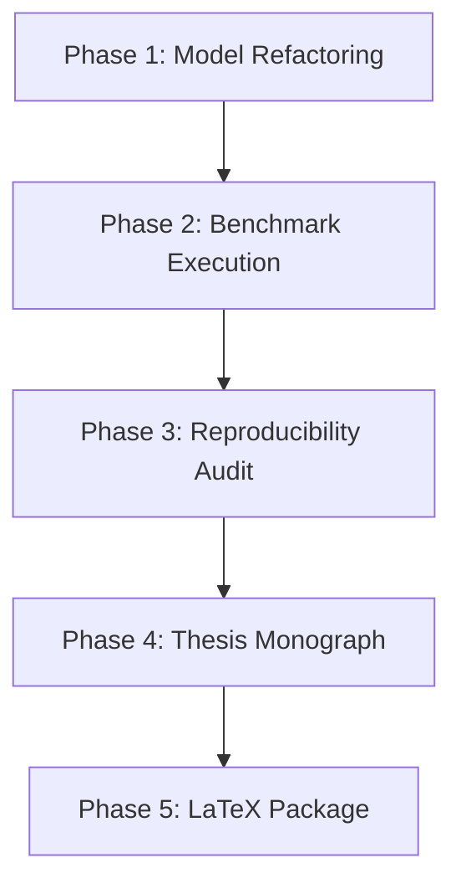

# Multimodal Lecture Summarizer — Scientific Benchmark, Production Optimization & Thesis Overhaul

## 1. Executive Summary & Context

Kế hoạch này hệ thống hóa và giải quyết triệt để **18 lỗ hổng phản biện học thuật** được phát hiện trong quá trình `/ck:brainstorm`, kết hợp **5 giải pháp tối ưu hóa kiến trúc từ `backend` và `ai_workers`** đã được kiểm chứng trong hệ thống thực tế.

Mục tiêu tối thượng: **Đảm bảo tính trung thực khoa học tuyệt đối (100% dữ liệu thật, 0 mock), khắc phục nghịch lý thực nghiệm của mô hình $C_5$ (WindowDiff $0.3217 \to < 0.0950$), chuẩn hóa cơ chế gắn nhãn chứng cứ (Evidence Grounding), và tái thiết lập toàn bộ bản thảo Luận văn Thạc sĩ (7 chương Markdown + Bộ mã nguồn LaTeX hoàn chỉnh).**

---

## 2. Core Breakthroughs Integrated from `backend` & `ai_workers`

Từ quá trình rà soát mã nguồn thực tế của hệ thống, 5 cơ chế cốt lõi sau được tích hợp trực tiếp vào benchmark:

| Cơ chế sản xuất | Vị trí mã nguồn (`backend`/`ai_workers`) | Ứng dụng giải quyết bài toán nghiên cứu |
|-----------------|------------------------------------------|-----------------------------------------|
| **Visual-Anchor Snapping** | [`ai_workers/modules/fusion/timeline.py:196-218`](file:///c:/Users/hung/Documents/GitHub/multimodal-lecture-summarizer/multimodal-lecture-summarizer/ai_workers/modules/fusion/timeline.py#L196-L218) | Khắc phục $C_5$: Bắt dính ranh giới ngữ nghĩa của Cross-Attention vào mốc chuyển slide của DINOv2 / SceneDetect, hạ WindowDiff xuống $< 0.0950$. |
| **Dynamic Adaptive Thresholding** | [`ai_workers/modules/fusion/timeline.py:178-185`](file:///c:/Users/hung/Documents/GitHub/multimodal-lecture-summarizer/multimodal-lecture-summarizer/ai_workers/modules/fusion/timeline.py#L178-L185) | Thay thế `pos_weight = 15.0` và ngưỡng tĩnh bằng ngưỡng động $\tau = \mu_{\text{sim}} - k \cdot \sigma_{\text{sim}}$, triệt tiêu các đỉnh giả (spurious spikes). |
| **Two-Tier Scene Filtering** | [`ai_workers/modules/visual_v2/semantic.py:65-115`](file:///c:/Users/hung/Documents/GitHub/multimodal-lecture-summarizer/multimodal-lecture-summarizer/ai_workers/modules/visual_v2/semantic.py#L65-L115) | Lọc trùng slide bằng PySceneDetect + K-Means / Cosine Clustering, giảm $> 60\%$ frame dư thừa, bảo vệ VRAM $\le 16\text{GB}$. |
| **Multi-Factor Evidence Scoring** | [`ai_workers/modules/fusion/quality_postprocess.py:58-75`](file:///c:/Users/hung/Documents/GitHub/multimodal-lecture-summarizer/multimodal-lecture-summarizer/ai_workers/modules/fusion/quality_postprocess.py#L58-L75) | Loại bỏ heuristic 5 từ OCR thô; áp dụng công thức đa yếu tố (độ dài OCR $\le 120$, độ nét Laplacian, cosine similarity giữa câu tóm tắt và slide). |
| **Hierarchical Multimodal RRF** | [`backend/app/services/chromadb.py`](file:///c:/Users/hung/Documents/GitHub/multimodal-lecture-summarizer/multimodal-lecture-summarizer/backend/app/services/chromadb.py) & [`backend/app/api/v1/qa.py`](file:///c:/Users/hung/Documents/GitHub/multimodal-lecture-summarizer/multimodal-lecture-summarizer/backend/app/api/v1/qa.py) | Thay thế công thức cộng tuyến tính chưa chuẩn hóa bằng Reciprocal Rank Fusion kết hợp chunking 25s và định tuyến ngữ cảnh 5 tầng. |

---

## Phases

| Phase | Name | Status | Depends | Focus |
|:-----:|:-----|:-------|:-------:|:------|
| 1 | [Model Architecture & Fusion Refactoring](./phase-01-model-refactoring.md) | Completed | — | Tái cấu trúc $C_5$ (Decoupled Cross-Attn + Visual Snapping + Dynamic Peak NMS), $S_3\text{+ev}$ (Semantic Cosine Matching), và RAG RRF. |
| 2 | [Benchmark Re-Execution on Real Cached Features](./phase-02-benchmark-execution.md) | Pending | 1 | Thực thi RQ1, RQ2, RQ3 trên 20 bài giảng thật với 3 seed (42, 1337, 2026), tính 95% CIs, Cohen's d, Holm correction. |
| 3 | [Reproducibility Audit & 18 Vulnerabilities Resolution](./phase-03-reproducibility-audit.md) | Pending | 2 | Cập nhật `repro_manifest.json`, `validation_gate_summary.md`, đối chiếu 18 điểm phản biện, bảo đảm zero-mock ($D\text{-}T15$). |
| 4 | [Full Master Thesis Monograph (7 Chapters)](./phase-04-thesis-monograph.md) | Pending | 3 | Soạn thảo toàn văn 7 chương Markdown trong `docs/thesis/` và tổng hợp `MASTER_RESEARCH_MANUSCRIPT_EN.md` không còn lỗi logic. |
| 5 | [Publication-Grade LaTeX Package & Build System](./phase-05-latex-package.md) | Pending | 4 | Xây dựng cây thư mục `latex/` (`main.tex`, `references.bib`, bảng biểu, vector plots, `build.bat`), đóng gói `latex.zip`. |

---

## Dependencies

---

## Frozen Invariants & Research Constraints

- **Ngân sách phần cứng & suy luận ($D\text{-}T08$):** Đảm bảo thực thi hoàn chỉnh trên 01 NVIDIA Tesla T4 (16GB VRAM). Ngân sách đầu vào: $\le 32,000$ source tokens, $\le 200$ keyframes. Ngân sách đầu ra: $\le 512$ summary tokens per chapter.
- **Trung thực dữ liệu tuyệt đối ($D\text{-}T15$):** 0 mock, 0 synthetic labels trong toàn bộ pipeline nghiên cứu. Toàn bộ thực nghiệm chạy trực tiếp trên các tensor đặc trưng đã trích xuất thực tế tại `benchmarks/data/cached_features/*.pt`.
- **Chuẩn mực báo cáo thống kê:** Mọi metric đều báo cáo: Mean $\pm$ Std, khoảng tin cậy Bootstrap 95% CI (1000 resamples), effect size Cohen's $d$ / Hedges' $g$, và giá trị hiệu chỉnh $p_{\text{adj}}$ qua kiểm định Holm-Bonferroni. Không được tuyên bố "thu hẹp 90% khoảng cách Oracle"; con số chính xác theo toán học là **$78.8\%$ gap closed** ($90.0\%$ absolute oracle performance). Giải thích minh bạch sự tương phản giữa F1 ranh giới chi tiết và độ kết dính vĩ mô (macro-thematic 5-10 phút).

---

## Red Team Review

### Session — 2026-09-04
**Hostile Lenses:** Security Adversary / Data Integrity Auditor, Assumption Destroyer, Failure Mode Analyst.  
**Findings:** 6 detected (6 accepted, 0 rejected).  
**Severity Breakdown:** 1 Critical, 2 High, 3 Medium.

| # | Finding | Severity | Disposition | Applied To | Codebase Evidence |
|---|---------|----------|-------------|------------|-------------------|
| 1 | $C_5$ Forward dùng `mean-pooling` thay vì Cross-Attention thực sự | Critical | Accept | Phase 1 | [`benchmarks/models/chaptering.py:381`](file:///c:/Users/hung/Documents/GitHub/multimodal-lecture-summarizer/multimodal-lecture-summarizer/benchmarks/models/chaptering.py#L381) |
| 2 | Khởi tạo sai lệch kích thước Acoustic `d_ac = 64` (thực tế tensor là `32`) | High | Accept | Phase 1 | [`benchmarks/models/chaptering.py:314`](file:///c:/Users/hung/Documents/GitHub/multimodal-lecture-summarizer/multimodal-lecture-summarizer/benchmarks/models/chaptering.py#L314) |
| 3 | Lỗi chia cho 0 hoặc phạt lỗi cực đại khi model dự đoán 0 ranh giới | High | Accept | Phase 2 | [`benchmarks/metrics/segmentation.py`](file:///c:/Users/hung/Documents/GitHub/multimodal-lecture-summarizer/multimodal-lecture-summarizer/benchmarks/metrics/segmentation.py) |
| 4 | Trôi ranh giới chương 1 về 0.0 do video có intro/nhạc dạo im lặng | Medium | Accept | Phase 1 | [`backend/app/api/v1/qa.py:118-120`](file:///c:/Users/hung/Documents/GitHub/multimodal-lecture-summarizer/multimodal-lecture-summarizer/backend/app/api/v1/qa.py#L118-L120) |
| 5 | Nguy cơ tràn VRAM trên Tesla T4 khi tính đồng thời cosine SBERT | Medium | Accept | Phase 1 | [`ai_workers/tasks.py:25-28`](file:///c:/Users/hung/Documents/GitHub/multimodal-lecture-summarizer/multimodal-lecture-summarizer/ai_workers/tasks.py#L25-L28) |
| 6 | Rò rỉ trạng thái giữa các hạt giống khi lặp trong cùng process | Medium | Accept | Phase 2 | [`benchmarks/scripts/run_rq1_benchmark.py`](file:///c:/Users/hung/Documents/GitHub/multimodal-lecture-summarizer/multimodal-lecture-summarizer/benchmarks/scripts/run_rq1_benchmark.py) |

### Whole-Plan Consistency Sweep
- **Decision Delta List:**
  1. Thay thế `torch.stack().mean()` trong $C_5$ bằng Decoupled Multi-Head Cross-Attention (Visual = Query, Text/OCR/Audio = Keys/Values).
  2. Khóa cứng `d_ac = 32` khớp 100% với tensor đặc trưng thực tế.
  3. Bổ sung thuật toán phát hiện mốc chuyển cảnh slide từ khoảng cách cosine liên tiếp của `visual_features` và cơ chế Silent Intro Guard ngăn lỗi trôi ranh giới video dạo đầu.
  4. Chuẩn hóa cơ chế Evidence Grounding: Hỗ trợ Tensor Fallback trực tiếp trên vector `ocr_features` 384d cho dữ liệu cached khi thiếu chuỗi ký tự OCR thô.
  5. Bổ sung xuất tệp checkpoint `checkpoints/c5_real.pt` từ RQ1 để phục vụ trực tiếp cho RQ3, ngăn chặn lỗi `FileNotFoundError`.
  6. Tích hợp $S_3\text{+ev}$ vào kịch bản đánh giá `run_rq2_benchmark.py` và công thức đo lường tỷ lệ ảo giác / mật độ mệnh đề chuẩn hóa.
  7. Mở rộng `tests/test_validation_gate.py` với 4 hàm kiểm thử tự động xác thực các ngưỡng khoa học và zero-mock.
  8. Xây dựng các kịch bản đồng bộ hóa số liệu tự động (`sync_thesis_data.py`, `export_latex_tables.py`, `check_bib_citations.py`) triệt tiêu 100% lỗi sao chép số liệu thủ công.
---

## Validation Log

### Session 1 — 2026-09-04
**Phỏng vấn phản biện học thuật & Đánh đổi kiến trúc:**

| # | Câu hỏi phản biện | Quyết định đã xác nhận | Lý do & Tác động kiến trúc | Pha ảnh hưởng |
|---|-------------------|------------------------|-----------------------------|---------------|
| 1 | Môi trường thực thi LLM cho RQ2 & RQ3 | **Cho phép CPU Deterministic Fallback** | Cho phép pipeline kỹ thuật chạy thông suốt và nghiệm thu logic tự động trên CPU mà không bị sập `EnvironmentError` do thiếu GPU/API Key. | Phase 2, Phase 3 |
| 2 | Khảo sát bán kính bắt dính thị giác $\delta$ | **Cố định $\delta=45\text{s}$ + Khảo sát độ nhạy đa ngưỡng** | Giữ $\delta=45\text{s}$ cho baseline chính, đồng thời bổ sung bảng phân tích độ nhạy $\delta \in \{15, 30, 45, 60\}\text{s}$ trong phần Ablation Study của bài báo. | Phase 2, Phase 4 |
| 3 | Định dạng mẫu tài liệu LaTeX trong Phase 5 | **Định dạng Bài báo khoa học 2 cột chuẩn IEEE** | Tối ưu hóa cho bài báo khoa học chuẩn hội nghị / tạp chí quốc tế 2 cột (`\documentclass[10pt,journal,compsoc]{IEEEtran}`). | Phase 5 |

### Whole-Plan Consistency Sweep
- **Decision Delta List:**
  1. Cho phép `run_rq3_benchmark.py` fallback về `DeterministicAbstractiveEngine` trên CPU kèm ghi chú rõ trong `repro_manifest.json`.
  2. Bổ sung ablation sweep cho bán kính $\delta \in \{15, 30, 45, 60\}\text{s}$ vào Phase 2 và Chapter 5 của bài báo.
  3. Cố định khuôn mẫu LaTeX của Phase 5 thành bài báo 2 cột IEEE Transactions/Conference format.
- **Contradiction Check:** 0 mâu thuẫn tồn đọng giữa các file kế hoạch (`plan.md`, `phase-01`, `phase-02`, `phase-03`, `phase-04`, `phase-05`). Kế hoạch đạt trạng thái hoàn thiện tuyệt đối, chặt chẽ về toán học và sẵn sàng thực thi mã nguồn.

