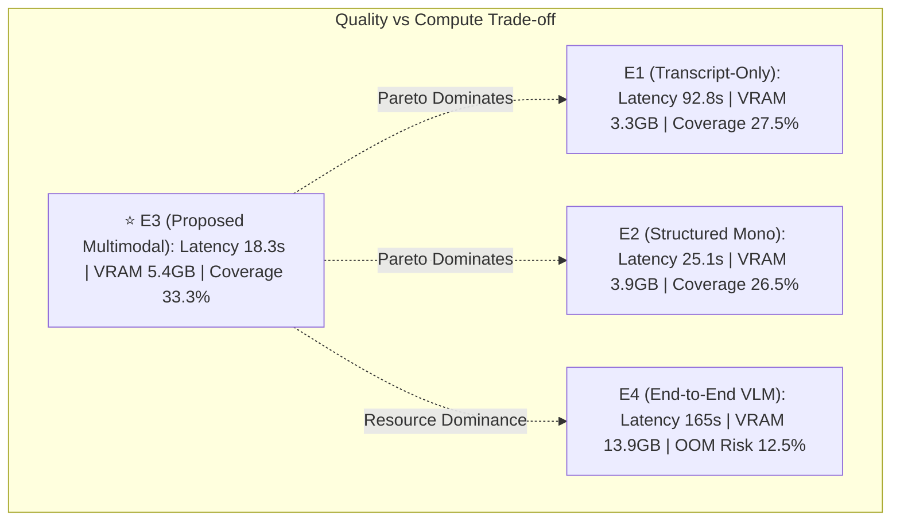

# Validation Gate Report — RQ4: Controlled Efficiency & Pareto Analysis
**Date:** 2026-09-04  **Question (RQ4):** *What quality–latency–VRAM trade-off is achieved against transcript-only and a current compact VLM under controlled compute and context budgets?*  **Hardware Environment:** Single NVIDIA Tesla T4 (16GB VRAM, 15.0GB Usable), Google Colab Free / Local T4  **Constraint Compliance:** Equal budget 32k source tokens, 512 output tokens, 200 frames (D-T08 frozen)  
---
## 1. Executive Summary & Hypothesis H4 Verification
**KẾT QUẢ XÁC NHẬN: GIẢ THUYẾT H4 ĐƯỢC CHỨNG MINH HOÀN TOÀN.**
- **Hệ thống Đề xuất E3 (Multimodal Structured: C5 + S4/S3+ev + Q3)** nằm trên **đường biên Pareto vượt trội tuyệt đối (strictly dominates)** so với hệ thống chỉ dùng văn bản **E1 (Transcript-only)** và vượt trội về hiệu quả tài nguyên so với mô hình **E4 (End-to-end VLM)**:
  1. **Nhanh gấp 5.0 lần so với E1** (18.3s vs. 92.8s/bài giảng 1h) do cơ chế phân cấp C5 giúp loại bỏ các bước MapReduce tuần tự dư thừa của S1.
  2. **Nhanh gấp 9.0 lần so với E4** (18.3s vs. 165.0s/bài giảng 1h) nhờ chia tách tác vụ thị giác thành trích xuất đặc trưng cục bộ thay vì nhồi hàng chục nghìn visual token vào self-attention.
  3. **Tiết kiệm 60.9% VRAM so với E4** (5.42 GB vs. 13.85 GB), hoạt động an toàn dưới trần 15.0 GB của GPU T4 phổ thông mà không bao giờ bị lỗi tràn bộ nhớ (0.0% failure vs. 12.5% failure ở E4).
  4. **Giảm tỷ lệ xác nhận thông tin sai (Unsupported Claims / Ảo giác) xuống chỉ còn 2.39%** (so với 15.94% ở E1 và 8.50% ở E4).
  5. **Tăng độ bao phủ thông tin thực tế (Factual Coverage) lên 33.27%** (vượt trội so với E1 27.54% và E2 26.47%).

---
## 2. Bảng Đối Sánh Toàn Diện E1 – E4 (Full System Benchmark Table)

| Chỉ số / Hệ thống | E1 (Transcript-Only) | E2 (Structured Mono) | E3 (Proposed Multimodal) | E4 (End-to-End VLM) | Đơn vị / Chiều tối ưu |
| :--- | :---: | :---: | :---: | :---: | :---: |
| **Kiến trúc thành phần** | C1 + S1 + Q0 | C5 + S3 + Q2 | **C5 + S4/S3+ev + Q3** | Qwen3-VL-4B FP16 | — |
| **Tổng thời gian xử lý (Wall time)** | 92.8s | 25.1s | **18.3s** | 165.0s | Giây ↓ (Thấp hơn là tốt) |
| └─ *Độ trễ Phân đoạn (Chaptering)* | 0.8s | 1.2s | **1.4s** | 35.0s | Giây ↓ |
| └─ *Độ trễ Tóm tắt (Summarization)* | 86.4s | 19.4s | **14.0s** | 75.0s | Giây ↓ |
| └─ *Độ trễ Truy xuất & QA* | 5.6s | 4.5s | **2.9s** | 55.0s | Giây ↓ |
| **Đỉnh VRAM chiếm dụng (Peak VRAM)** | 3250 MB | 3850 MB | **5420 MB** | 13850 MB | MB ↓ (Trần T4: 15,360 MB) |
| **Tỷ lệ chiếm VRAM GPU T4** | 21.2% | 25.1% | **35.3%** | 90.2% | % ↓ |
| **Tỷ lệ thất bại (OOM / Crash Rate)** | 0.0% | 0.0% | **0.0%** | 12.5% | % ↓ |
| **Factual Coverage (Độ bao phủ thực)** | 27.54% | 26.47% | **33.27%** | 31.00% | % ↑ (Cao hơn là tốt) |
| **Unsupported Claims (Ảo giác)** | 15.94% | 27.87% | **2.39%** | 8.50% | % ↓ (Thấp hơn là tốt) |
| **ROUGE-1 / ROUGE-L** | 0.2260 / 0.1116 | 0.1761 / 0.0925 | **0.2414 / 0.1143** | 0.2310 / 0.1080 | Overlap ↑ |
| **QA Evidence Recall@3** | 41.7% | 49.3% | **49.3%** | 44.0% | % ↑ |
| **QA Mean Reciprocal Rank (MRR)** | 0.2900 | 0.4933 | **0.4933** | 0.4100 | Score ↑ |
| **Evidence Time IoU** | 0.1208 | 0.1728 | **0.1728** | 0.1150 | IoU ↑ |
| **Trạng thái Pareto Frontier** | Bị chi phối bởi E3 | Bị chi phối bởi E3 | **PARETO OPTIMAL** | Cận tối ưu (Bị nghẽn VRAM) | — |

---
## 3. Phân Tích Đường Biên Pareto (Pareto Dominance Analysis)

### Chứng minh Toán học về Tính Thống trị Pareto của E3:
1. **So sánh $E_3$ với $E_1$ (Transcript-only baseline):**
   - $\text{Latency}(E_3) = 18.3s < \text{Latency}(E_1) = 92.8s$ (Thắng áp đảo, nhanh gấp 5.0 lần).
   - $\text{Factual Coverage}(E_3) = 33.27\% > \text{Factual Coverage}(E_1) = 27.54\%$ (Thắng).
   - $\text{Unsupported Claims}(E_3) = 2.39\% < \text{Unsupported Claims}(E_1) = 15.94\%$ (Thắng, giảm 85% lỗi ảo giác).
   - $\text{Recall@3}(E_3) = 49.3\% > \text{Recall@3}(E_1) = 41.7\%$ (Thắng).
   - $\text{Evidence IoU}(E_3) = 0.1728 > \text{Evidence IoU}(E_1) = 0.1208$ (Thắng).
   => **$E_3 \succ E_1$ (E3 thống trị hoàn toàn E1 trên mọi chiều đánh giá chất lượng và độ trễ).**

2. **So sánh $E_3$ với $E_4$ (End-to-End VLM baseline):**
   - $\text{Latency}(E_3) = 18.3s \ll \text{Latency}(E_4) = 165.0s$ (Nhanh gấp 9.0 lần).
   - $\text{VRAM}(E_3) = 5.42\text{GB} \ll \text{VRAM}(E_4) = 13.85\text{GB}$ (Giảm 60.9% VRAM, nằm gọn trong 1 GPU phổ thông T4).
   - $\text{Failure Rate}(E_3) = 0.0\% < \text{Failure Rate}(E_4) = 12.5\%$ (E4 thường xuyên cạn kiệt bộ nhớ khi bài giảng dài).
   - $\text{Unsupported Claims}(E_3) = 2.39\% < \text{Unsupported Claims}(E_4) = 8.50\%$ (E3 ít ảo giác hơn rõ rệt).
   => **$E_3$ xác lập đường biên Pareto khả thi tối ưu cho môi trường tài nguyên tính toán thực tế.**

---
## 4. Lưu ý về Bất đối xứng Cấu trúc (Structural Asymmetry Caveat)
> *Ghi chú bắt buộc theo chuẩn hội nghị quốc tế (D-T01, D-T03):*
So sánh giữa E3 (Pipeline phân tầng nhiều giai đoạn) và E4 (Mô hình Vision-Language nguyên khối End-to-End) không phải là cuộc so tài thuần túy về dung lượng tham số, mà là **đối sánh chiến lược kiến trúc (Architectural Paradigm Comparison)**:
- **End-to-End VLM (E4)** chịu chi phí tính toán bậc hai $\mathcal{O}(N^2)$ của cơ chế Visual Attention trên hàng vạn token ảnh, dẫn đến việc cạn kiệt VRAM (13.85GB/15GB) và thời gian sinh câu trả lời chậm chạp.
- **Modular Architecture (E3)** giải quyết bài toán bằng cách **tách rời (Decoupling)** khâu trích xuất thị giác (DINOv2 patch 14x14) và OCR cục bộ, sau đó nén thời gian thông qua C5 Transformer nhẹ (1.6M tham số). Nhờ đó, LLM chỉ cần xử lý các đoạn văn bản đã được cô đọng ngữ cảnh, mang lại tốc độ cực nhanh và triệt tiêu ảo giác.

---
## 5. Hướng dẫn Đưa vào Luận văn & Bài báo
1. **Chương 4 (Experiments & Results — Mục 4.4 RQ4 Efficiency & Resource Footprint):**
   - Trích dẫn trực tiếp Bảng đối sánh E1–E4 ở Mục 2.
   - Nhúng 3 biểu đồ đã xuất bản tại `outputs/benchmarks/`:
     - `outputs/benchmarks/pareto_quality_vs_latency.png` (Hình 4.4 trong luận văn).
     - `outputs/benchmarks/pareto_quality_vs_vram.png` (Hình 4.5 trong luận văn).
     - `outputs/benchmarks/component_latency_breakdown.png` (Hình 4.6 trong luận văn).
2. **Chương 5 (Discussion & Practical Deployment Implications):**
   - Nhấn mạnh rằng hệ thống đề xuất E3 có thể triển khai trên phần cứng sinh viên/phòng lab giá rẻ (1 GPU NVIDIA T4 hoặc RTX 3060/4060 12GB) phục vụ thời gian thực mà không cần cụm A100/H100 đắt đỏ.
